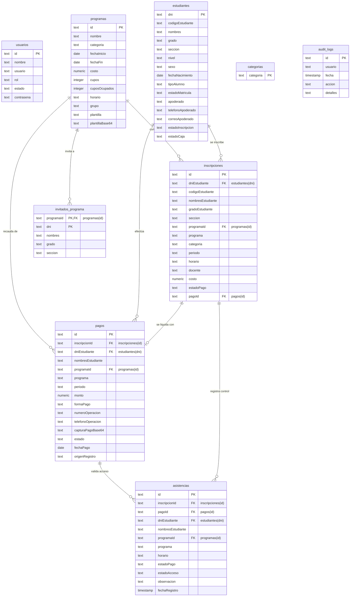

# Reporte de Estructura de Base de Datos - Módulo Extracurricular
**Colegio San Rafael**

Este documento detalla la arquitectura, relaciones, volúmenes de datos y el flujo de la información de la base de datos alojada en **Supabase Cloud** para el sistema de talleres y actividades extracurriculares.

---

## 1. Origen y Proveedor de Datos
De acuerdo con las configuraciones del entorno (`.env`), el sistema está conectado a un servidor de base de datos relacional PostgreSQL administrado en la nube:
* **Proveedor:** Supabase Cloud
* **URL del Proyecto:** `https://viempuopsjtgfnsspjxv.supabase.co`
* **Modo de Datos:** Producción / Supabase Cloud

---

## 2. Volumen de Datos Actual (Registros Activos)
Consulta realizada en vivo el 19 de Junio de 2026:

| Tabla en Supabase | Propósito | Nro. Registros |
| :--- | :--- | :---: |
| `usuarios` | Cuentas de usuario y control de accesos (roles) | **7** |
| `estudiantes` | Padrón escolar de alumnos registrados | **14** |
| `programas` | Talleres y programas extracurriculares ofertados | **6** |
| `inscripciones` | Ficha de pre-matriculación (asigna alumno a taller) | **1** |
| `pagos` | Transacciones financieras (cobros presenciales y web) | **2** |
| `asistencias` | Control de entrada en puerta (asistido / rechazado) | **1** |
| `invitados_programa` | Relación de alumnos pre-aprobados por taller | **2** |
| `categorias` | Clasificación de talleres (Académico, Deportivo, etc.) | **9** |
| `audit_logs` | Bitácora de auditoría y operaciones del sistema | **272** |

---

## 3. Diagrama de Entidad-Relación (ERD)

A continuación se muestra el mapa visual de relaciones del sistema de base de datos en imagen:


También puedes visualizar la estructura jerárquica mediante la siguiente sintaxis de Mermaid:



---

## 4. Diccionario de Datos (Estructura de Tablas)

### 4.1. Tabla: `usuarios`
Registra las cuentas del personal administrativo y educativo del plantel con control de roles.
* **Clave Primaria:** `id`

| Columna | Tipo de Datos | Descripción / Valores |
| :--- | :--- | :--- |
| `id` | `text` | Identificador único del usuario (UUID o correlativo). |
| `nombre` | `text` | Nombre completo del empleado. |
| `usuario` | `text` | Nombre de usuario para iniciar sesión. |
| `rol` | `text` | Permisos en el sistema: `Administrador`, `Secretaria`, `Caja`, `Coordinacion`, `Auxiliar`, `Direccion`. |
| `estado` | `text` | Estado de la cuenta: `Activo` o `Inactivo`. |
| `contrasena` | `text` | Clave de acceso encriptada. |

---

### 4.2. Tabla: `estudiantes`
Directorio centralizado de alumnos de los niveles Inicial, Primaria y Secundaria.
* **Clave Primaria:** `dni`

| Columna | Tipo de Datos | Descripción / Valores |
| :--- | :--- | :--- |
| `dni` | `text` | DNI del estudiante (8 dígitos). |
| `codigoEstudiante` | `text` | Código interno de matrícula del alumno. |
| `nombres` | `text` | Nombre completo del estudiante. |
| `grado` | `text` | Grado escolar (Ej. "4 Primaria"). |
| `seccion` | `text` | Sección (Ej. "A", "B", "C"). |
| `nivel` | `text` | Nivel educativo: `Inicial`, `Primaria`, `Secundaria`. |
| `sexo` | `text` | Género: `M` o `F`. |
| `fechaNacimiento` | `date` | Fecha de nacimiento del menor. |
| `tipoAlumno` | `text` | Clasificación: `Alumno interno`, `Alumno externo`, `Alumno invitado`. |
| `estadoMatricula` | `text` | Estado escolar: `Activo`, `Inactivo`. |
| `apoderado` | `text` | Nombre del padre o apoderado responsable. |
| `telefonoApoderado` | `text` | Teléfono de contacto del apoderado. |
| `correoApoderado` | `text` | Correo electrónico de contacto. |
| `estadoInscripcion` | `text` | Estado de la ficha del alumno. |
| `estadoCaja` | `text` | Situación financiera global del alumno. |

---

### 4.3. Tabla: `programas`
Catálogo de los talleres extracurriculares ofertados en el periodo escolar o de vacaciones.
* **Clave Primaria:** `id`

| Columna | Tipo de Datos | Descripción / Valores |
| :--- | :--- | :--- |
| `id` | `text` | Código del taller (Ej. `PROG-1`). |
| `nombre` | `text` | Nombre descriptivo del taller (Ej. "Fútbol"). |
| `categoria` | `text` | Relación con la tabla `categorias`. |
| `fechaInicio` | `date` | Fecha de inicio de clases. |
| `fechaFin` | `date` | Fecha de término del taller. |
| `costo` | `numeric` | Costo base del taller en Soles (`S/.`). |
| `cupos` | `integer` | Capacidad total de vacantes del aula. |
| `cuposOcupados` | `integer` | Número de alumnos matriculados actualmente. |
| `horario` | `text` | Días y horas en que se dicta (Ej. "Lun-Mie 3:00pm"). |
| `grupo` | `text` | **Meta-columna JSON** que serializa atributos dinámicos (duración, responsable, docente, ciclos, requisitos). |
| `plantilla` | `text` | Nombre del archivo de plantilla de constancias. |
| `plantillaBase64` | `text` | Contenido de la plantilla física en formato Base64. |

---

### 4.4. Tabla: `inscripciones`
Mapea la pre-matriculación del estudiante a un taller. Registra también si se le ha aprobado un beneficio o descuento especial por Dirección.
* **Clave Primaria:** `id`
* **Claves Foráneas:** `dniEstudiante` -> `estudiantes(dni)`, `programaId` -> `programas(id)`, `pagoId` -> `pagos(id)`

| Columna | Tipo de Datos | Descripción / Valores |
| :--- | :--- | :--- |
| `id` | `text` | Código de la inscripción (Ej. `INS-48192`). |
| `dniEstudiante` | `text` | DNI del alumno inscrito. |
| `nombresEstudiante` | `text` | Nombres del alumno (desnormalizado para rapidez). |
| `programaId` | `text` | Código del programa. |
| `programa` | `text` | Nombre del taller. |
| `costo` | `numeric` | Costo final a pagar (monto original menos descuentos, si aplica). |
| `estadoPago` | `text` | Estado de la deuda: `Pendiente`, `Pagado`. |
| `pagoId` | `text` | ID del comprobante de caja si ya se liquidó. |
| `descuentoAprobado` | `boolean` | `true` si Dirección aprobó un beneficio financiero. |
| `descuentoTipo` | `text` | Tipo de beneficio: `beca` (100%), `porcentaje` o `monto`. |
| `descuentoValor` | `numeric` | Porcentaje de descuento (%) o monto fijo a restar (S/.). |
| `descuentoMonto` | `numeric` | Monto monetario exacto descontado de la pensión. |
| `descuentoJustificacion` | `text` | Motivo o sustento de la aprobación de beca. |

---

### 4.5. Tabla: `pagos`
Registro de cobros ejecutados en caja física o enviados por los padres desde la web (por verificar).
* **Clave Primaria:** `id`
* **Claves Foráneas:** `inscripcionId` -> `inscripciones(id)`, `dniEstudiante` -> `estudiantes(dni)`

| Columna | Tipo de Datos | Descripción / Valores |
| :--- | :--- | :--- |
| `id` | `text` | Identificador de la boleta/recibo de caja. |
| `inscripcionId` | `text` | Enlace a la ficha de inscripción asociada. |
| `dniEstudiante` | `text` | DNI del estudiante que realiza el pago. |
| `monto` | `numeric` | Importe cobrado/pagado en Soles (`S/.`). |
| `formaPago` | `text` | Medio: `Efectivo`, `Transferencia`, `Yape`. |
| `numeroOperacion` | `text` | Nro. de operación bancaria o Yape. |
| `telefonoOperacion` | `text` | Número de celular desde el que se emitió el Yape. |
| `capturaPagoBase64` | `text` | Imagen del voucher de pago subida por el padre. |
| `estado` | `text` | Situación: `completado`, `pendiente`, `observado`, `rechazado`. |
| `fechaPago` | `date` | Fecha en que se cobró/ingresó el dinero. |
| `origenRegistro` | `text` | Canal de cobro: `Caja` (presencial) o `Portal padres` (vía web). |

---

### 4.6. Tabla: `asistencias`
Registro de asistencia en vivo al ingreso del colegio, contrastado contra el estado de pago.
* **Clave Primaria:** `id`

| Columna | Tipo de Datos | Descripción / Valores |
| :--- | :--- | :--- |
| `id` | `text` | Identificador único del registro de ingreso. |
| `inscripcionId` | `text` | Inscripción que ampara el taller. |
| `dniEstudiante` | `text` | DNI del alumno. |
| `nombresEstudiante` | `text` | Nombre completo del alumno. |
| `programa` | `text` | Nombre del taller al que ingresa. |
| `estadoAcceso` | `text` | Resultado en puerta: `permitido` o `rechazado`. |
| `observacion` | `text` | Anotación del auxiliar (Ej. "Olvidó indumentaria"). |
| `fechaRegistro` | `timestamp` | Fecha y hora exacta de la lectura. |

---

## 5. Flujo de Datos del Sistema

El siguiente mapa conceptual ilustra cómo viaja la información entre los distintos roles operativos:

```
[ SECRETARÍA ] ── Registra Pre-Inscripción Alumno (DNI + Taller)
       │
       ▼
 [ DIRECCIÓN ] ── (Opcional) Aplica Beca o Descuento (Modifica costo de Inscripción)
       │
       ▼
    [ CAJA ] ── Valida Pago Web (Yape/Voucher) o Recibe Efectivo (Genera Pago)
       │
       ▼
  [ AUXILIAR ] ── Escanea DNI en puerta (Valida contra Pago / Estado Inscripción)
```
