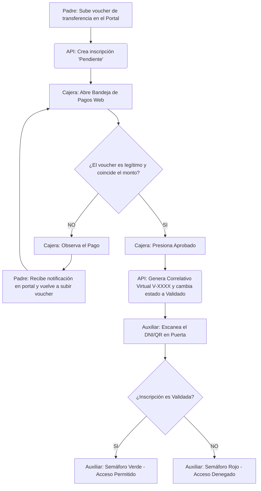

# MANUAL TÉCNICO Y OPERATIVO DEL SISTEMA: MÓDULO EXTRACURRICULAR

Este documento constituye la especificación técnica completa y el manual de operaciones del **Módulo Extracurricular**, una plataforma de nivel empresarial diseñada para automatizar la gestión de programas extracurriculares, talleres escolares, control de recaudación en caja, control de accesos por QR/DNI y la automatización de la expedición de constancias impresas y digitales en una institución educativa.

---

## TABLA DE CONTENIDOS

1. [Introducción y Propósito del Sistema](#1-introducción-y-propósito-del-sistema)
2. [Arquitectura de Software y Stack Tecnológico](#2-arquitectura-de-software-y-stack-tecnológico)
3. [Estructura de Directorios del Código Fuente](#3-estructura-de-directorios-del-código-fuente)
4. [Modos de Persistencia e Integración Híbrida de Datos](#4-modos-de-persistencia-e-integración-híbrida-de-datos)
5. [Guía Operativa Detallada de Módulos (Roles)](#5-guía-operativa-detallada-de-módulos-roles)
6. [Referencia Completa de la API y Endpoints](#6-referencia-completa-de-la-api-y-endpoints)
7. [Diccionario de Datos y Modelo de Entidades](#7-diccionario-de-datos-y-modelo-de-entidades)
8. [Flujos de Trabajo e Integraciones Críticas](#8-flujos-de-trabajo-e-integraciones-críticas)
9. [Instalación, Configuración y Despliegue Local](#9-instalación-configuración-y-despliegue-local)

---

## 1. Introducción y Propósito del Sistema

El **Módulo Extracurricular** surge para solucionar el vacío operacional en la administración de actividades fuera del horario escolar regular (deportes, idiomas, talleres artísticos y certificaciones internacionales como Cambridge). 

El sistema consolida en una sola herramienta web:
*   La oferta académica configurable y restrictiva según el grado del estudiante.
*   El autoservicio de inscripción para padres de familia con carga digital de vouchers de pago.
*   El control financiero diario de la caja del colegio (POS, transferencias y efectivo) con emisión de correlativos controlados.
*   El control de accesos físico al colegio por parte de los auxiliares en puerta utilizando dispositivos móviles/tablets para leer códigos QR.
*   La emisión instantánea de fichas y constancias firmadas en PDF y Word mediante inyección de datos sobre plantillas prediseñadas.

---

## 2. Arquitectura de Software y Stack Tecnológico

El sistema se implementa bajo un patrón arquitectónico desacoplado de cliente-servidor, con comunicación segura basada en API REST y Server-Sent Events (SSE) para sincronización en tiempo real.

```
[ Frontend: React / Mantine UI ] 
        │             ▲
        ▼             │ (HTTP REST & SSE / Sync)
[ Backend: Node.js / Express Server ]
        │             ▲
        ▼             │ (Mirroring / writeQueue)
[ Local: db.json ] ◄──┴──► [ Nube: Supabase PostgreSQL ]
```

### Frontend (Cliente Web)
*   **Core**: React 19 y Vite como entorno de compilación rápida.
*   **UI/UX**: Mantine UI (v9) para la disposición de rejillas, ventanas modales, calendarios, tablas dinámicas y componentes de formularios estructurados.
*   **Estilos**: TailwindCSS (v4) para micro-utilidades y personalizaciones de diseño premium.
*   **Enrutamiento**: React Router DOM (v7) implementando Lazy Loading para la segregación de código por roles.
*   **Gráficos**: `@mantine/charts` basado en Recharts para analíticas de dirección.

### Backend (Servidor de Aplicaciones)
*   **Runtime**: Node.js v18+.
*   **Framework**: Express.js (v5) para el enrutamiento API.
*   **Gestión de Carga**: Multer para el parseo de archivos multimedia y documentos en memoria.
*   **Procesamiento de Archivos**:
    *   `exceljs`: Lectura de listas masivas de alumnos desde hojas de cálculo.
    *   `docxtemplater` y `pizzip`: Renderizado de plantillas `.docx` con tags dinámicos.
    *   `pdf-lib`: Fusión de lotes de PDFs de invitaciones y conversión de Word a PDF.
*   **Seguridad**: `jsonwebtoken` (JWT) para la firma y validación de tokens de sesión con expiración de 24 horas, y `bcryptjs` para el hashing de claves.

---

## 3. Estructura de Directorios del Código Fuente

```
Modulo-Extracurricular/
├── server/                     # Código del servidor (Backend)
│   ├── routes/                 # Controladores y enrutamiento API
│   │   ├── authRoutes.js       # Login de administradores y acceso de padres
│   │   ├── programaRoutes.js   # ABM de talleres, cargas de Excel, asistencias
│   │   ├── inscripcionRoutes.js# Matrícula de estudiantes, generación de Word
│   │   ├── pagoRoutes.js       # Recaudación, validación de transferencias
│   │   ├── direccionRoutes.js  # Reportes estadísticos, descuentos, correlativos
│   │   └── syncRoutes.js       # Suscripción SSE para sync en tiempo real
│   ├── middleware/             # Interceptores de autenticación y roles
│   ├── excelPreviewService.js  # Validador y procesador de Excel de alumnos
│   ├── fileProcessing.js       # Utilidades de PDF, conversión de Word
│   ├── localDb.js              # Controlador del motor de datos local/nube
│   ├── audit.js                # Motor de logging e historial de acciones
│   └── excelApi.js             # Punto de entrada de la aplicación Express
├── src/                        # Código del cliente (Frontend)
│   ├── components/             # Componentes globales (Login, headers)
│   ├── services/               # Clientes API (apiClient, dbApi, sync)
│   ├── mantineTheme.js         # Tokens de diseño personalizados (Mantine)
│   ├── App.jsx                 # Enrutamiento React y control de sesiones
│   └── modules/                # Vistas y componentes empaquetados por Rol
│       ├── administrador/      # CRUD de usuarios, logs de auditoría
│       ├── auxiliar/           # Consola de escaneo QR y control de puerta
│       ├── caja/               # Panel de cobranzas, arqueos y reportes
│       ├── coordinacion/       # Creación de talleres, plantillas y Excel
│       ├── direccion/          # Dashboards gerenciales y becas
│       ├── padres/             # Portal de auto-matrícula del apoderado
│       └── secretaria/         # Emisión de constancias y reportes de impresión
```

---

## 4. Modos de Persistencia e Integración Híbrida de Datos

El sistema implementa un motor de datos redundante controlado por variables de entorno que permite trabajar en diferentes escenarios:

### A. Modo Desarrollo Offline / Servidor Autónomo (`DATA_MODE=local`)
El servidor almacena y lee los datos directamente de un archivo plano JSON (`server/db.json`). Las mutaciones son síncronas en memoria y se persisten de forma asíncrona mediante una cola de escritura (`writeQueue`) para evitar bloqueos del sistema.

### B. Modo Integrado Cloud (`DATA_MODE=supabase`)
El backend utiliza la librería `@supabase/supabase-js` para conectarse a PostgreSQL. Para evitar sobrecargar la base de datos con peticiones constantes de lectura (como la consulta rápida del auxiliar de puerta):
*   Se implementa una caché en memoria de Supabase con tiempo de vida parametrizable (`SUPABASE_CACHE_TTL_MS`).
*   Las escrituras se realizan en la base local (`db.json`) y se encolan inmediatamente para reflejarse de forma asíncrona en Supabase.
*   En caso de fallo de red con Supabase, los cambios se retienen localmente y el sistema sigue operando, sincronizándose cuando se reestablece la conexión.

---

## 5. Guía Operativa Detallada de Módulos (Roles)

### A. Módulo de Coordinación Académica
Es el encargado de estructurar la oferta de talleres del año escolar.
1.  **Creación de Talleres**: Configura el nombre del taller, periodo académico, costo y cupos máximos. Define restricciones específicas de grados aplicables (ej: "Solo de 3° a 5° Primaria").
2.  **Configuración de Servicios Adicionales**: Asocia si el taller requiere la compra de uniforme obligatorio (talla del polo/short) o si incluye servicio de almuerzo comedor (especificando concesionarios y horarios).
3.  **Carga Masiva de Alumnos Invitados**: Para talleres cerrados, el coordinador descarga la plantilla Excel del sistema, ingresa los DNI de los alumnos permitidos y sube el archivo. El sistema previsualiza coincidencias y errores (como alumnos inactivos en el colegio) antes de procesar la importación final.
4.  **Vinculación de Plantillas**: Sube el archivo `.docx` de la matrícula. El sistema mapea las etiquetas (ej. `{nombres_estudiante}`) y las deja listas para la generación automática.

### B. Módulo de Caja (Cajera)
Responsable del flujo financiero diario.
1.  **Cobro en Ventanilla**: Busca al alumno por su DNI. El sistema calcula automáticamente el monto neto a cobrar tras aplicar descuentos autorizados. Se registra el medio de pago (Efectivo, Tarjeta, Depósito) y se emite el número de comprobante correspondiente.
2.  **Cola de Aprobación Web**: Muestra los pagos subidos por los padres desde el portal. La cajera abre un visor con el comprobante digital (captura del depósito bancario). Puede:
    *   **Aprobar**: Genera el recibo virtual serie `V-` y matricula definitivamente al estudiante.
    *   **Observar**: Rechaza temporalmente indicando la causa (ej: "Monto depositado incompleto") para que el padre la corrija.
    *   **Rechazar**: Cancela el proceso liberando la vacante del taller.
3.  **Anulaciones y Egresos**: Módulo para registrar gastos de caja (compra de materiales) y anulación de comprobantes por error de digitación.

### C. Módulo de Dirección
Monitoreo estratégico y autorizaciones especiales.
1.  **Dashboard de Métricas**: Estadísticas de ingresos acumulados frente a las metas del periodo, número de matriculados activos por categoría y gráficos de distribución de medios de pago.
2.  **Módulo de Descuentos (Becas)**: Dirección busca un estudiante pre-inscrito y le aplica un descuento (Beca del 100%, Semi-beca del 50%, o monto fijo). Se debe especificar de manera obligatoria el nombre de la dirección emisora y la justificación académica.
3.  **Control de Correlativos**: Ajusta el número secuencial de inicio para los comprobantes emitidos en caja para alinearlos con la contabilidad física del colegio.

### D. Módulo de Secretaría
Atención y expedición de documentos.
1.  **Buscador Centralizado**: Permite ubicar estudiantes y ver su estado de inscripción.
2.  **Impresión de Fichas**: El asistente selecciona el taller y el estudiante, y el sistema genera una descarga en `.docx` o `.pdf` del comunicado/ficha personalizado con los datos inyectados del alumno.

### E. Módulo Auxiliar (Control de Puerta)
Control físico del ingreso de alumnos.
1.  **Consola Lector QR / DNI**: El auxiliar activa la cámara web del dispositivo para escanear el QR generado para el alumno o digita manualmente su DNI.
2.  **Verificador de Reglas de Acceso**: El sistema evalúa:
    *   ¿El alumno tiene un pago aprobado por caja?
    *   ¿El día de hoy corresponde con el horario del grupo asignado?
    *   ¿El estudiante está ingresando a la hora correcta?
3.  **Panel de Semáforo**: Si cumple todo, se muestra una alerta verde en pantalla gigante con los datos y foto del alumno. De lo contrario, se pinta en rojo con el motivo detallado de la denegación de acceso.

### F. Portal de Padres
Autoservicio para apoderados.
1.  **Ingreso Seguro**: El padre digita el DNI del alumno y su fecha de nacimiento registrada en la matrícula escolar regular.
2.  **Paso 1 - Selección de Talleres**: Muestra la lista de talleres disponibles para el grado del alumno. Si el taller es cerrado, solo se mostrará si fue precargado como invitado por Coordinación.
3.  **Paso 2 - Aceptación de Cláusulas**: Despliega los reglamentos y comunicados oficiales que el padre debe marcar como aceptados.
4.  **Paso 3 - Ficha del Apoderado**: Actualización obligatoria de datos de contacto (teléfono y correo) para alertas del taller.
5.  **Paso 4 - Carga de Pago**: Selección de banco de destino y subida de la imagen del comprobante de transferencia bancaria.

---

## 6. Referencia Completa de la API y Endpoints

### Autenticación y Cuentas (`authRouter`)
*   `POST /api/v1/auth/login`
    *   **Descripción**: Autenticación de operadores administrativos.
    *   **Cuerpo (JSON)**: `{ "username": "cajera", "password": "..." }`
    *   **Respuesta**: `{ "success": true, "token": "JWT_TOKEN", "user": { "nombre": "...", "role": "caja" } }`
*   `POST /api/v1/extracurricular/padres/validar`
    *   **Descripción**: Validación de estudiantes para el ingreso al portal de padres.
    *   **Cuerpo**: `{ "dni": "77778888", "fecha_nacimiento": "2015-05-12" }`
    *   **Respuesta**: Retorna datos de matrícula del estudiante y JWT firmado para el portal de padres.

### Gestión de Programas y Talleres (`programaRouter`)
*   `GET /api/v1/extracurricular/programas`
    *   **Descripción**: Retorna todos los programas vigentes. Requiere Token.
*   `POST /api/v1/extracurricular/programas`
    *   **Rol Permitido**: `coordinacion`
    *   **Descripción**: Crea un nuevo taller.
*   `POST /api/v1/extracurricular/programas/documento`
    *   **Rol Permitido**: `coordinacion`, `secretaria`
    *   **Descripción**: Sube un archivo Word base y mapea sus variables dinámicas.
*   `POST /api/v1/extracurricular/coordinacion/cargas/confirmar`
    *   **Rol Permitido**: `coordinacion`
    *   **Descripción**: Procesa la carga masiva temporal de Excel y crea los invitados en la base de datos de manera definitiva.

### Cobros y Caja (`pagoRouter`)
*   `POST /api/v1/extracurricular/pagos`
    *   **Rol Permitido**: `caja`
    *   **Descripción**: Registra una recaudación presencial en caja e incrementa el correlativo asignado.
*   `PUT /api/v1/extracurricular/pagos/:pagoId/validar`
    *   **Rol Permitido**: `caja`
    *   **Descripción**: Valida el pago web de un padre, cambia el estado de la inscripción a `Validado` y genera un número de recibo virtual.
*   `PUT /api/v1/extracurricular/pagos/:pagoId/observar`
    *   **Rol Permitido**: `caja`
    *   **Descripción**: Observa el pago web adjuntando una justificación.
*   `GET /api/v1/extracurricular/caja/reporte`
    *   **Roles**: `caja`, `direccion`
    *   **Descripción**: Retorna el consolidado de ventas del día actual con filtros avanzados de fecha, categoría y medios de pago.

### Reportes Estratégicos y Dirección (`direccionRouter`)
*   `GET /api/v1/extracurricular/reportes/resumen`
    *   **Rol Permitido**: `direccion`
    *   **Descripción**: Estadísticas agregadas de ingresos proyectados, reales y número de matrículas agrupadas por estado.
*   `PUT /api/v1/extracurricular/inscripciones/:inscripcionId/descuento`
    *   **Rol Permitido**: `direccion`
    *   **Descripción**: Aplica un descuento parametrizado a una pre-inscripción pendiente.

---

## 7. Diccionario de Datos y Modelo de Entidades

A continuación se detalla la estructura física de las entidades del sistema en formato de base de datos relacional (PostgreSQL):

### Tabla: `usuarios`
| Campo | Tipo | Nulabilidad | Restricciones | Descripción |
| :--- | :--- | :--- | :--- | :--- |
| `id` | UUID / SERIAL | NOT NULL | PK | Identificador único |
| `nombre` | VARCHAR(150) | NOT NULL | | Nombre y apellido del operador |
| `usuario` | VARCHAR(50) | NOT NULL | UNIQUE | Nombre de inicio de sesión |
| `rol` | VARCHAR(30) | NOT NULL | | Rol asignado (administrador, coordinacion, etc.) |
| `estado` | VARCHAR(20) | NOT NULL | | Activo o Inactivo |
| `contrasena` | VARCHAR(255) | NOT NULL | | Contraseña encriptada en Bcrypt |

### Tabla: `estudiantes`
| Campo | Tipo | Nulabilidad | Restricciones | Descripción |
| :--- | :--- | :--- | :--- | :--- |
| `dni` | VARCHAR(15) | NOT NULL | PK | DNI del estudiante |
| `codigoEstudiante` | VARCHAR(30) | NOT NULL | | Código de matrícula oficial |
| `nombres` | VARCHAR(150) | NOT NULL | | Nombres completos |
| `grado` | VARCHAR(50) | NOT NULL | | Grado (ej: 1° Primaria) |
| `seccion` | VARCHAR(10) | NOT NULL | | Sección asignada (A, B, C) |
| `nivel` | VARCHAR(30) | NOT NULL | | Nivel (Inicial, Primaria, Secundaria) |
| `fechaNacimiento` | VARCHAR(15) | NOT NULL | | Formato `AAAA-MM-DD` |
| `apoderado` | VARCHAR(150) | | | Nombre del apoderado legal |
| `telefonoApoderado`| VARCHAR(20) | | | Teléfono del apoderado |
| `correoApoderado` | VARCHAR(100) | | | Email del apoderado |
| `estadoMatricula` | VARCHAR(20) | NOT NULL | | Estado regular (Activo/Retirado) |

### Tabla: `programas`
| Campo | Tipo | Nulabilidad | Restricciones | Descripción |
| :--- | :--- | :--- | :--- | :--- |
| `id` | UUID / SERIAL | NOT NULL | PK | Identificador único del programa |
| `nombre` | VARCHAR(150) | NOT NULL | | Nombre del taller o programa |
| `categoria` | VARCHAR(50) | NOT NULL | | Deportes, Idiomas, Música, etc. |
| `costo` | DECIMAL(10,2) | NOT NULL | | Costo unitario o mensual del taller |
| `cupos` | INT | NOT NULL | | Aforo máximo de estudiantes |
| `cuposOcupados` | INT | NOT NULL | DEFAULT 0 | Vacantes reservadas actualmente |
| `gradosAplicables`| JSONB | NOT NULL | | Array de grados aptos para matrícula |
| `periodo` | VARCHAR(20) | NOT NULL | | Periodo lectivo (ej: `2026-I`) |
| `modalidadCobro` | VARCHAR(30) | NOT NULL | | Mensual, Pago Único, etc. |
| `estado` | VARCHAR(20) | NOT NULL | | Activo, Finalizado, Archivado |

### Tabla: `inscripciones`
| Campo | Tipo | Nulabilidad | Restricciones | Descripción |
| :--- | :--- | :--- | :--- | :--- |
| `id` | VARCHAR(30) | NOT NULL | PK | Código de pre-inscripción `INS-XXXXX` |
| `dniEstudiante` | VARCHAR(15) | NOT NULL | FK (`estudiantes.dni`)| DNI del alumno inscrito |
| `programaId` | UUID / INT | NOT NULL | FK (`programas.id`) | ID del taller matriculado |
| `costoOriginal` | DECIMAL(10,2) | NOT NULL | | Costo base del taller |
| `descuentoMonto` | DECIMAL(10,2) | NOT NULL | DEFAULT 0 | Descuento total aplicado |
| `costo` | DECIMAL(10,2) | NOT NULL | | Costo neto a cobrar en caja |
| `estadoPago` | VARCHAR(20) | NOT NULL | | Pendiente, Validado, Observado, etc. |
| `pagoId` | VARCHAR(30) | | FK (`pagos.id`) | Relación al comprobante de caja |
| `origenRegistro` | VARCHAR(20) | NOT NULL | | Canal (`web` para padres, `caja` presencial)|
| `fechaRegistro` | TIMESTAMP | NOT NULL | | Fecha del registro de pre-inscripción |

### Tabla: `pagos`
| Campo | Tipo | Nulabilidad | Restricciones | Descripción |
| :--- | :--- | :--- | :--- | :--- |
| `id` | VARCHAR(30) | NOT NULL | PK | Identificador único de pago `PAG-XXXXX` |
| `inscripcionId` | VARCHAR(30) | NOT NULL | FK (`inscripciones.id`)| ID de la matrícula asociada |
| `monto` | DECIMAL(10,2) | NOT NULL | | Monto depositado o abonado |
| `formaPago` | VARCHAR(30) | NOT NULL | | Efectivo, Tarjeta, Transferencia |
| `numeroOperacion` | VARCHAR(50) | | | Nro de operación bancaria |
| `capturaPagoBase64`| TEXT | | | Imagen del voucher de transferencia |
| `nro_recibo` | VARCHAR(30) | | | Serie correlativa oficial emitida |
| `estado` | VARCHAR(20) | NOT NULL | | Pendiente, Aprobado, Rechazado, Anulado |
| `fechaPago` | TIMESTAMP | NOT NULL | | Fecha de la operación bancaria o cobro |

---

## 8. Flujos de Trabajo e Integraciones Críticas

### A. Conciliación de Pagos Web y Activación de Asistencia
El siguiente diagrama detalla cómo se relacionan los diferentes roles ante el pago de un apoderado desde la web:



### B. Sustitución de Variables en Plantillas Microsoft Word
Para los reportes impresos de secretaría, el sistema lee una plantilla y ejecuta el siguiente proceso en el backend:
1.  **Recuperación**: El servidor Express consulta la tabla de programas y extrae el archivo Word codificado en Base64 (`plantillaBase64`).
2.  **Decodificación**: Se convierte el Base64 en un ArrayBuffer y se inicializa una instancia de `PizZip` en Node.js.
3.  **Compilación**: La librería `docxtemplater` compila el archivo Zip de Word.
4.  **Inyección**: Se inyectan las variables recopiladas desde el perfil de estudiante e inscripción (ej: nombres completos, DNI, grado, nombres del apoderado, fecha de inicio).
5.  **Conversión y Descarga**: El backend reconstruye el archivo `.docx` procesado y lo envía al cliente para su previsualización mediante `docx-preview` en el navegador o descarga como Word nativo.

### C. El Asistente Virtual Rafael (Lógica Contextual Local)
El portal de padres incluye a **Rafael**, un asistente virtual interactivo que ayuda a resolver consultas comunes sobre el proceso de matrícula escolar de sus hijos sin requerir llamadas de red para procesamiento de lenguaje natural o depender de APIs de IA externas:
1.  **Normalización e Intenciones**: El texto de consulta es normalizado (remoción de tildes y conversión a minúsculas) y procesado por una máquina de coincidencia de palabras clave y pesos (`detectarIntencionAsistente`) local en [padresAssistantUtils.js](file:///c:/Users/leonc/OneDrive/Desktop/Modulo%20Extracurricular/src/modules/padres/utils/padresAssistantUtils.js). Clasifica la consulta en intenciones como: `saludo`, `comprobante`, `pago`, `horario`, `ficha`, `estado`, `siguiente`, `programa`, `apoderado` o `contacto`.
2.  **Generación de Respuestas Dinámicas**: Rafael lee en tiempo real el estado en memoria de la sesión:
    *   **Siguiente paso (Guía)**: Si el usuario está atascado y pregunta qué debe hacer, el asistente evalúa el paso actual en [StepperProceso.jsx](file:///c:/Users/leonc/OneDrive/Desktop/Modulo%20Extracurricular/src/modules/padres/components/StepperProceso.jsx) y valida los campos del formulario. Le dirá exactamente si le falta completar el teléfono, aceptar el comunicado, subir el comprobante o esperar la validación de Caja.
    *   **Horarios y Costos**: Extrae el horario, costo y nombre del taller asignado al grado del estudiante directamente del objeto `programa`.
    *   **Auditoría de Pagos**: Si ya hay un comprobante en revisión, informa al padre el estado actual del pago (`Pendiente`, `Aprobado` o `Observado`) y la justificación dada por la cajera en caso de observación.

---

## 9. Instalación, Configuración y Despliegue Local

### Requisitos Técnicos Mínimos
*   **Node.js**: Versión LTS 18.16.0 o superior.
*   **Gestor de paquetes**: `pnpm` (versión recomendada) o `npm`.
*   **Navegador Web**: Chrome, Edge o Firefox en versiones estables recientes.

### Guía de Configuración Rápida

1.  **Clonar el repositorio**:
    ```bash
    git clone https://github.com/JUANLCHUMBE5/Modulo-Extracurricular.git
    cd Modulo-Extracurricular
    ```

2.  **Configurar Variables de Entorno**:
    Cree un archivo `.env` en la raíz del proyecto. Copie el contenido de `.env.example` y configure lo siguiente para desarrollo local:
    ```env
    DATA_MODE=local
    VITE_DATA_MODE=local
    VITE_API_MODE=api
    VITE_LOCAL_API_URL=http://127.0.0.1:5175
    PORT=5175
    JWT_SECRET=secreto_seguro_para_pruebas_locales_123
    ```

3.  **Instalar Dependencias de Forma Automatizada**:
    Ejecute el archivo por lotes en la consola de comandos de Windows (cmd):
    ```bash
    .\instalar-dependencias.cmd
    ```
    *(Este script ejecuta `pnpm install` tanto para el frontend como para los servicios backend)*.

4.  **Levantar el Entorno de Desarrollo**:
    Para iniciar el servidor de desarrollo Vite y el backend Node de Express en paralelo en un solo comando:
    ```bash
    .\iniciar-react.cmd
    ```
    *   **Frontend**: Disponible en `http://localhost:5173`.
    *   **Backend (API)**: Escuchando en `http://localhost:5175`.
