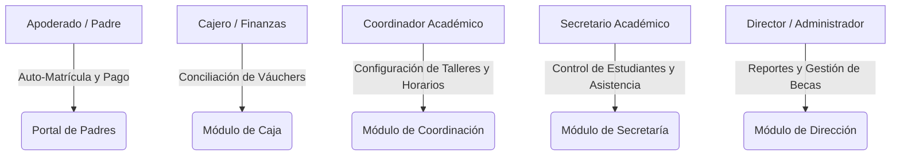
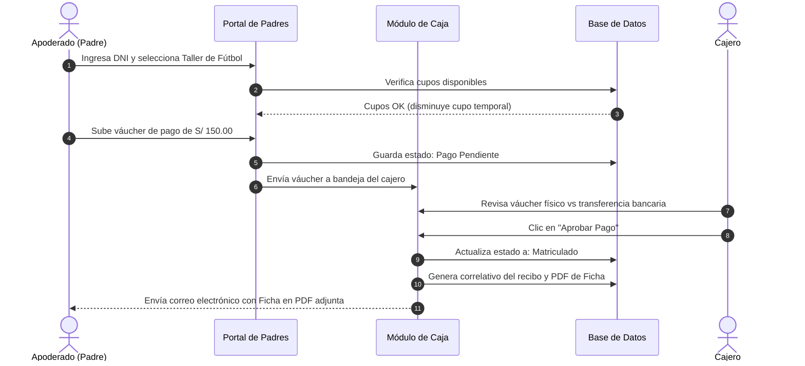

# 🎓 Módulo Extracurricular - Portafolio de Proyecto

Bienvenido al repositorio del **Módulo Extracurricular**, un sistema integral diseñado para automatizar y optimizar la gestión de matrículas, facturación, control de asistencia y asignación de horarios en programas escolares extracurriculares. 

Este repositorio funciona exclusivamente como un **portafolio de presentación**, detallando la arquitectura del sistema, la implementación tecnológica y la estrategia de aseguramiento de calidad (QA). El código fuente y los archivos binarios están excluidos del tracking público para proteger la propiedad intelectual del proyecto.

---

## 📁 Estructura del Portafolio

*   📂 [`imagenes/`](./imagenes/) - Carpeta destinada a las capturas de pantalla e interfaces de usuario del sistema (caja, portal de padres, secretaría, etc.).
*   📄 [`README.md`](./README.md) - Documentación técnica detallada sobre el diseño, arquitectura y QA del software.

---

## 🎯 Descripción General del Sistema

El **Módulo Extracurricular** centraliza operaciones que tradicionalmente se realizan en hojas de cálculo manuales. Permite a los padres de familia autogestionar la matrícula de sus hijos en talleres recreativos y académicos, automatiza la validación financiera de los pagos y proporciona herramientas administrativas de control y reporte a la dirección, secretaría y caja del plantel.

### 👥 Módulos y Roles del Sistema

1.  **Portal de Padres (Auto-Matrícula)**
    *   **Autenticación rápida**: Acceso seguro mediante el DNI del estudiante regular o externo.
    *   **Catálogo Interactivo**: Listado inteligente de talleres aplicables según la edad, nivel escolar y grado del estudiante.
    *   **Servicios Adicionales**: Selección de indumentaria, uniformes oficiales, almuerzos (con control de concesionarios) y exámenes internacionales de Cambridge.
    *   **Pasarela de Pago Manual**: Carga del váucher digital de transferencia bancaria directa o códigos QR de pago (Yape/Plim).
    *   **Compromiso en PDF**: Generación y descarga inmediata del documento oficial de compromiso de matrícula firmado digitalmente.

2.  **Módulo de Coordinación Académica**
    *   Creación, edición y control de aforo de talleres.
    *   Configuración dinámica de avisos publicitarios, calendarios de exámenes e invitaciones directas.
    *   Envío automatizado de invitaciones masivas y avisos de matrícula vía correo electrónico.
    *   Control consolidado de asistencia por taller y grupo.

3.  **Módulo de Caja (Conciliación Financiera)**
    *   Bandeja de auditoría en tiempo real para todos los váuchers cargados por los padres de familia.
    *   Aprobación/Rechazo de transacciones (con justificación personalizada enviada de inmediato al apoderado).
    *   Generación automática de números correlativos y emisión digital de recibos de caja.
    *   Exportación de movimientos del día a formato Excel estructurado para la contabilidad general.

4.  **Módulo de Dirección (Administración General)**
    *   Visualización de métricas generales de ingresos por taller, cantidad de alumnos matriculados y tendencias.
    *   Gestión y aprobación de becas y porcentajes de descuento a estudiantes destacados o con convenios.
    *   Control de correlativos globales del sistema.

5.  **Módulo de Secretaría**
    *   Carga masiva histórica de registros de estudiantes desde plantillas de Excel, reduciendo a segundos la migración de datos inicial.
    *   Monitoreo general y consulta consolidada de asistencia por alumnos en formato matricial.

---

## 🛠️ Arquitectura de Software y Tecnologías

El sistema está estructurado bajo una arquitectura cliente-servidor robusta, moderna y desacoplada:

### 💻 Frontend (Desarrollo Web)
*   **Biblioteca Principal**: **React 18** estructurado con **TypeScript** para un tipado estático seguro.
*   **Construcción y Bundler**: **Vite.js** para compilaciones ultra rápidas y recarga en caliente eficiente.
*   **Estilos y UX**: Hojas de estilo **CSS nativas y variables globales**, garantizando un diseño a medida sin la sobrecarga de frameworks como Tailwind. La interfaz adopta paletas en tonos verdes y grises corporativos, transiciones suaves y adaptabilidad responsiva completa (móviles y escritorio).

### ⚙️ Backend (API REST)
*   **Entorno de Ejecución**: **Node.js** con **TypeScript**.
*   **Framework**: **Express.js** para la gestión de enrutamiento RESTful.
*   **Capa de Validación (DTOs)**: Implementación de esquemas de validación estricta con **Zod** en todas las rutas `POST` y `PUT`. Esto garantiza que cualquier entrada corrupta o maliciosa sea rechazada en la frontera del servidor antes de procesarse.
*   **Manejo de Errores**: Middleware centralizado de control de excepciones y respuestas HTTP consistentes.

### 🗄️ Base de Datos y Persistencia
*   **Motor Principal**: **PostgreSQL 17** con soporte de conexiones seguras y cifradas mediante SSL.
*   **ORM**: **Sequelize** para el mapeo objeto-relacional, facilitando consultas seguras mediante abstracciones tipadas e impidiendo ataques de inyección SQL.
*   **Modo Híbrido**: Soporta ejecución en modo local (`DATA_MODE=local`) mediante almacenamiento relacional simulado en archivos JSON, permitiendo el despliegue rápido del sistema sin configurar una base de datos física.

### 📧 Integraciones y Seguridad
*   **Autenticación**: JSON Web Tokens (**JWT**) firmados criptográficamente para la gestión de sesiones de usuario administrativo.
*   **Seguridad de Contraseñas**: Encriptación hash utilizando **bcryptjs** (10 salt rounds).
*   **Notificaciones**: Cliente **Nodemailer** integrado para la comunicación directa a servidores de correo SMTP oficiales al momento de confirmar una matrícula, rechazar un váucher o invitar a un taller.

---

## 🧪 Estrategia de Aseguramiento de Calidad (QA)

Para este proyecto, el control de calidad es un pilar fundamental. Se definió un plan de pruebas estructurado para garantizar la confiabilidad financiera, el correcto control de accesos y la integridad de los datos en picos de alta demanda.

### 1. Pruebas Unitarias (Unit Testing)
*   **Objetivo**: Validar el correcto funcionamiento de la lógica de negocio pura y utilidades del sistema.
*   **Ejemplos de Validaciones**:
    *   Normalización y parseo de horarios estructurados (ej. conversión de `"Lunes, Miércoles: 15:00 - 16:30"` a variables de impresión).
    *   Algoritmos de cálculo de costos netos aplicando becas y descuentos específicos (ej. descuento del 25%, 50%, 100% y becas especiales).
    *   Validación lógica de aforos disponibles basados en `cupos - cuposOcupados`.

### 2. Pruebas de Integración (API & Schema Testing)
*   **Objetivo**: Garantizar que el flujo de datos entre el cliente y el servidor cumple estrictamente con el contrato de la API.
*   **Ejemplos de Validaciones**:
    *   **Validación de payloads con Zod**: Pruebas automáticas donde payloads mal formateados (ej. campos de texto en lugar de números en costos, formatos de correo inválidos, DNI con longitud incorrecta) reciben un código `400 Bad Request` con mensajes legibles.
    *   Verificación de respuestas ante credenciales JWT inválidas, expiradas o ausentes (`401 Unauthorized` / `403 Forbidden`).
    *   Asegurar el correcto flujo de migración de datos masivos mediante pruebas de carga de archivos Excel simulados en el endpoint de Secretaría.

### 3. Pruebas Funcionales de Extremo a Extremo (E2E Testing)
*   **Objetivo**: Simular el comportamiento real del usuario cubriendo flujos completos que atraviesan múltiples módulos del sistema.

#### 🔄 Escenario Crítico de Prueba: Flujo Completo de Inscripción y Conciliación

*   **Puntos de control (Checkpoints) del escenario**:
    1.  El DNI ingresado debe existir en el semillero de alumnos.
    2.  El cupo del taller seleccionado debe incrementarse en ocupados al finalizar el flujo.
    3.  El váucher cargado debe aparecer inmediatamente en la cola de Caja con estado `Pendiente`.
    4.  Tras la aprobación en Caja, el estado del pago debe cambiar a `Aprobado` y el estudiante a `Matriculado`.
    5.  El sistema debe generar un código de recibo secuencial único (ej. `REC-000105`) que no se duplique ante solicitudes paralelas.
    6.  El apoderado debe recibir el PDF del compromiso firmado digitalmente en su correo electrónico de contacto.

### 4. Pruebas de Carga y Control de Concurrencia
*   **Objetivo**: Validar el comportamiento del sistema ante múltiples usuarios tratando de matricularse simultáneamente en un taller con cupos limitados (Race Conditions).
*   **Estrategia de Mitigación Probada**:
    *   **Control transaccional**: Se implementó lógica de base de datos a nivel de Sequelize con transacciones administradas y bloqueos optimistas.
    *   **Validación de cupo de última milla**: El cupo disponible se valida dos veces: al renderizar el catálogo y justo antes de guardar la inscripción en la base de datos. Si el cupo se agotó durante el proceso de llenado del formulario, el backend aborta la operación de forma segura y notifica al usuario sin guardar datos huérfanos.

### 5. Pruebas de Seguridad y Validación de Archivos (Vulnerabilidades)
*   **Validación de Váuchers**: Pruebas de penetración simuladas mediante la carga de archivos no permitidos (ej. ejecutables `.exe`, scripts `.js`, PDFs falsos) en el portal de padres. El middleware de subida restringe y valida estrictamente el tipo MIME del archivo (aceptando únicamente imágenes `.png`, `.jpg`, `.jpeg` y documentos `.pdf`) para prevenir ataques de ejecución remota.
*   **Doble Envío (Double Submit)**: Mecanismos en el frontend (deshabilitar botones al enviar) y validación en backend de solicitudes repetidas en un rango menor a 3 segundos para evitar cargos o registros duplicados.

---

## 📈 Resultados del Proyecto
El sistema ha demostrado un rendimiento excelente en pruebas simuladas de carga de datos, permitiendo:
*   Reducir el tiempo de matrícula de un alumno de **15 minutos presenciales a menos de 2 minutos online**.
*   Eliminar el **100% de los errores humanos** por asignación manual de cupos o traslape de horarios.
*   Lograr la conciliación bancaria instantánea y unificada con emisión automática de recibos contables.
