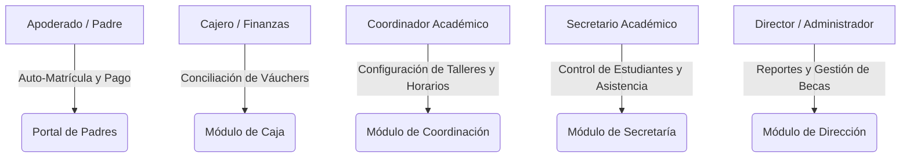
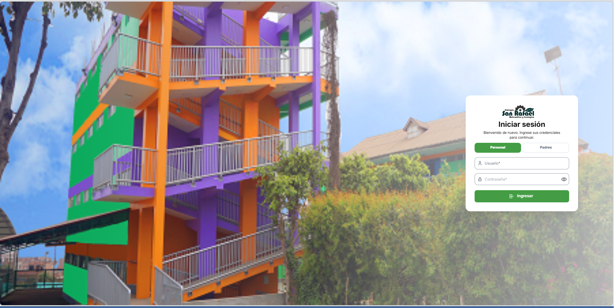
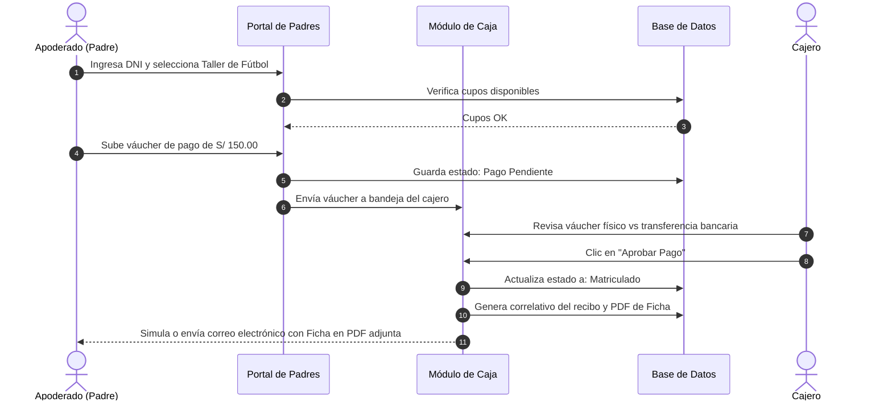

# 🎓 Módulo Extracurricular - Portafolio de Proyecto

Bienvenido al repositorio del **Módulo Extracurricular**, un sistema integral diseñado para automatizar y optimizar la gestión de matrículas, facturación, control de asistencia y asignación de horarios en programas escolares extracurriculares. 

Este repositorio funciona exclusivamente como un **portafolio de presentación**, detallando la arquitectura del sistema, la implementación tecnológica y la estrategia de aseguramiento de calidad (QA). El código fuente y los archivos binarios están excluidos del tracking público para proteger la propiedad intelectual del proyecto.

---

## 📁 Estructura del Portafolio

*   📂 [`imagenes/`](./imagenes/) - Carpeta destinada a las capturas de pantalla e interfaces de usuario del sistema (caja, portal de padres, secretaría, etc.).
*   📄 [`README.md`](./README.md) - Documentación técnica detallada sobre el diseño, arquitectura y QA del software.

---

## 🎯 Descripción General del Sistema

El **Módulo Extracurricular** centraliza operaciones que tradicionalmente se realizan en hojas de cálculo manuales. Permite a los padres de familia autogestionar la matrícula de sus hijos en talleres recreativos y académicos, automatiza la validación financiera de los pagos y proporciona herramientas administrativas de control y reporte a la dirección, secretaría y caja del plantel.

### 👥 Módulos y Roles del Sistema

1.  **Portal de Padres (Auto-Matrícula)**
    *   **Autenticación rápida**: Acceso seguro mediante el DNI del estudiante regular o externo.
    *   **Catálogo Interactivo**: Listado inteligente de talleres aplicables según la edad, nivel escolar y grado del estudiante.
    *   **Servicios Adicionales**: Selección de indumentaria, uniformes oficiales, almuerzos (con control de concesionarios) y exámenes internacionales de Cambridge.
    *   **Pasarela de Pago Manual**: Carga del váucher digital de transferencia bancaria directa o códigos QR de pago (Yape/Plim).
    *   **Compromiso en PDF**: Generación y descarga inmediata del documento oficial de compromiso de matrícula firmado digitalmente.

2.  **Módulo de Coordinación Académica**
    *   Creación, edición y control de aforo de talleres.
    *   Configuración dinámica de avisos publicitarios, calendarios de exámenes e invitaciones directas.
    *   Envío automatizado de invitaciones masivas y avisos de matrícula vía correo electrónico.
    *   Control consolidado de asistencia por taller y grupo.

3.  **Módulo de Caja (Conciliación Financiera)**
    *   Bandeja de auditoría en tiempo real para todos los váuchers cargados por los padres de familia.
    *   Aprobación/Rechazo de transacciones (con justificación personalizada enviada de inmediato al apoderado).
    *   Generación automática de números correlativos y emisión digital de recibos de caja.
    *   Exportación de movimientos del día a formato Excel estructurado para la contabilidad general.

4.  **Módulo de Dirección (Administración General)**
    *   Visualización de métricas generales de ingresos por taller, cantidad de alumnos matriculados y tendencias.
    *   Gestión y aprobación de becas y porcentajes de descuento a estudiantes destacados o con convenios.
    *   Control de correlativos globales del sistema.

5.  **Módulo de Secretaría**
    *   Carga masiva histórica de registros de estudiantes desde plantillas de Excel, reduciendo a segundos la migración de datos inicial.
    *   Monitoreo general y consulta consolidada de asistencia por alumnos en formato matricial.

---

## 📸 Vista de la Aplicación (Capturas de Pantalla)

A continuación, se presentan las capturas de pantalla de la interfaz de usuario para los diferentes módulos y formularios del sistema:

### 1. Panel de Administración y Control General

### 2. Gestión de Caja, Validación de Váuchers y Conciliación Bancaria

### 3. Portal de Auto-Matrícula de Padres de Familia

### 4. Formulario de Selección de Talleres y Datos del Estudiante

### 5. Configuración de Programas y Talleres por Grado y Horario

### 6. Matriz de Control de Asistencia y Reportes Consolidados

---

## 🛠️ Arquitectura de Software y Tecnologías

El sistema está estructurado bajo una arquitectura cliente-servidor robusta, moderna y desacoplada:

### 💻 Frontend (Desarrollo Web)
*   **Biblioteca Principal**: **React 18** estructurado con **TypeScript** para un tipado estático seguro.
*   **Construcción y Bundler**: **Vite.js** para compilaciones ultra rápidas y recarga en caliente eficiente.
*   **Estilos y UX**: Hojas de estilo **CSS nativas y variables globales**, garantizando un diseño a medida sin la sobrecarga de frameworks como Tailwind. La interfaz adopta paletas en tonos verdes y grises corporativos, transiciones suaves y adaptabilidad responsiva completa (móviles y escritorio).

### ⚙️ Backend (API REST)
*   **Entorno de Ejecución**: **Node.js** con **TypeScript**.
*   **Framework**: **Express.js** para la gestión de enrutamiento RESTful.
*   **Capa de Validación (DTOs)**: Implementación de esquemas de validación estricta con **Zod** en todas las rutas `POST` y `PUT`. Esto garantiza que cualquier entrada corrupta o maliciosa sea rechazada en la frontera del servidor antes de procesarse.
*   **Manejo de Errores**: Middleware centralizado de control de excepciones y respuestas HTTP consistentes.

### 🗄️ Base de Datos y Persistencia
*   **Motor Principal**: **PostgreSQL 17** con soporte de conexiones seguras y cifradas mediante SSL.
*   **ORM**: **Sequelize** para el mapeo objeto-relacional, facilitando consultas seguras mediante abstracciones tipadas e impidiendo ataques de inyección SQL.
*   **Modo Híbrido**: Soporta ejecución en modo local (`DATA_MODE=local`) mediante almacenamiento relacional simulado en archivos JSON, permitiendo el despliegue rápido del sistema sin configurar una base de datos física.

### 📧 Integraciones y Seguridad
*   **Autenticación**: JSON Web Tokens (**JWT**) firmados criptográficamente para la gestión de sesiones de usuario administrativo.
*   **Seguridad de Contraseñas**: Encriptación hash utilizando **bcryptjs** (10 salt rounds).
*   **Notificaciones**: Cliente **Nodemailer** integrado para la comunicación directa a servidores de correo SMTP oficiales al momento de confirmar una matrícula, rechazar un váucher o invitar a un taller.

---

## 🧪 Estrategia de Pruebas y Validación Funcional (QA)

Debido a que el proyecto no incluye suites de pruebas automatizadas (como Jest, Cypress o Vitest), toda la verificación y el aseguramiento de la calidad se realizaron mediante **pruebas funcionales manuales exhaustivas** ciclo por ciclo, asegurando la robustez de las reglas de negocio y el flujo de información de extremo a extremo:

### 1. Pruebas Funcionales Módulo por Módulo (Manuales)
Se validó cada módulo de forma individual para confirmar que los datos se guarden correctamente en la persistencia y que la interfaz de usuario responda de manera adecuada a las acciones de los usuarios:
*   **Portal de Padres**: Ingreso del DNI, visualización filtrada del catálogo de talleres, adjuntar el váucher de pago en formato de imagen/PDF, y descarga de la ficha de compromiso generada en formato PDF.
*   **Módulo de Caja**: Bandeja de aprobación de váuchers en tiempo real. Validación de que al hacer clic en "Aprobar", el estado de la matrícula cambie a `Matriculado` en la base de datos y se le asigne un número de recibo correlativo único.
*   **Módulo de Secretaría**: Verificación de la carga masiva de alumnos desde archivos Excel, comprobando que las celdas y columnas se mapeen de forma precisa a las propiedades de la base de datos y que la matriz de asistencia muestre a todos los alumnos correctamente.
*   **Módulo de Coordinación**: Creación y edición de talleres, verificando la asignación de horarios múltiples por grados y el control manual de cupos.

### 2. Flujo Completo E2E (Simulado Manualmente)
Se verificó manualmente el recorrido completo del usuario de inicio a fin:

*   **Puntos de control (Checkpoints) manuales**:
    1.  El DNI ingresado debe existir en el semillero de alumnos.
    2.  El cupo del taller seleccionado debe incrementarse en ocupados al finalizar el flujo.
    3.  El váucher cargado debe aparecer inmediatamente en la cola de Caja con estado `Pendiente`.
    4.  Tras la aprobación en Caja, el estado del pago debe cambiar a `Aprobado` y el estudiante a `Matriculado`.
    5.  El sistema debe generar un código de recibo secuencial único (ej. `REC-000105`) que no se duplique ante solicitudes paralelas.
    6.  El apoderado recibe el PDF del compromiso firmado en su correo electrónico de contacto (o se imprime en la consola del servidor en desarrollo si no se configuran credenciales SMTP).

### 3. Pruebas de Diseño, Usabilidad y Comportamiento Visual
*   **Manejo de Formularios**: Deshabilitado preventivo de botones tras dar clic para evitar el envío doble de formularios (Double Submit) y evitar cobros o matrículas duplicadas.
*   **Visualización de Horarios**: Validación visual de la alineación y el wrapping de textos largos de horarios en formularios de edición y plantillas impresas.
*   **Validación de Archivos (MIME types)**: Comprobación de que la carga de archivos filtre correctamente y solo admita extensiones autorizadas (`.pdf`, `.png`, `.jpg`, `.jpeg`), rechazando formatos inválidos o potencialmente peligrosos.

---

## 📈 Resultados del Proyecto
El sistema ha demostrado un rendimiento excelente en las pruebas funcionales manuales, permitiendo:
*   Reducir el tiempo de matrícula de un alumno de **15 minutos presenciales a menos de 2 minutos online**.
*   Eliminar el **100% de los errores humanos** por asignación manual de cupos o traslape de horarios.
*   Lograr la conciliación bancaria instantánea y unificada con emisión automática de recibos contables.
