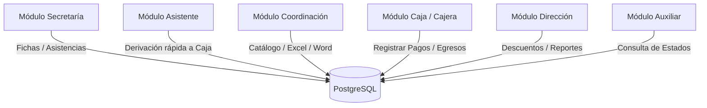

# Documentación de Requisitos Funcionales Detallados - Módulo Extracurricular

Esta sección detalla los requisitos funcionales del sistema **Módulo Extracurricular** por cada módulo y sus respectivos sub-módulos o pestañas internas, desglosados en responsabilidades del Frontend (interfaz de usuario, flujos visuales) y responsabilidades del Backend (endpoints, validación Zod DTO y operaciones en la base de datos relacional PostgreSQL).

---

## 1. Módulos y Roles del Sistema

El sistema implementa **6 perfiles de acceso (roles)** que interactúan sobre la base de datos relacional:

---

## 2. Detalle Funcional por Módulo y Sub-Módulo

### 2.1. Módulo de Secretaría
Gestiona las matrículas iniciales de alumnos, ventas adicionales de uniformes y el control diario de asistencias.

#### Sub-módulo 2.1.1: Ficha de Inscripción Regular
*   **Responsabilidades del Frontend**:
    *   Interfaz en `SecretariaNormalRegistroForm.tsx`.
    *   Buscador interactivo que valida el ingreso del DNI (numérico, longitud exacta de 8 dígitos).
    *   Consulta automática al escribir el DNI para autocompletar nombres, apellidos, grado, nivel y sección.
    *   Formulario de datos del apoderado con validaciones de campos obligatorios en cliente: nombre, teléfono de contacto y correo electrónico.
    *   Selector de talleres disponibles filtrados automáticamente según el grado aplicable del estudiante regular.
*   **Responsabilidades del Backend**:
    *   **Endpoint**: `POST /api/secretaria/registrar-regular` (o vía `POST /api/padres-inscripcion/inscripciones`).
    *   **Validación de Datos (Zod DTO)**: Valida el body usando `CrearInscripcionSchema`:
        *   `estudiante_id`: `z.string()` (Requerido - DNI del alumno)
        *   `programa_id`: `z.string()` (Requerido)
        *   `apoderado`: `z.string().optional()`
        *   `telefono_apoderado`: `z.string().optional()`
        *   `correo_apoderado`: `z.string().optional()`
    *   **Base de Datos**: Verifica la existencia del alumno en la tabla `estudiantes`. Inserta una nueva fila en la tabla `inscripciones` en estado `Pendiente` y actualiza los datos de contacto del apoderado.

#### Sub-módulo 2.1.2: Ficha de Alumno Externo / Invitado
*   **Responsabilidades del Frontend**:
    *   Interfaz en `SecretariaSummerRegistroForm.tsx`.
    *   Permite el ingreso manual de todos los campos personales del alumno (nombres, apellidos, DNI nuevo, sexo, grado, sección y colegio de procedencia) al no pertenecer al padrón regular.
    *   Marcar casillas del tipo de beneficio o alumno especial (`Externo` / `Invitado`).
*   **Responsabilidades del Backend**:
    *   **Endpoint**: `POST /api/secretaria/registrar-externo` (o similar).
    *   **Validación de Datos (Zod DTO)**: Valida la información del estudiante externo.
    *   **Base de Datos**: Inserta el nuevo registro del alumno externo en la tabla `estudiantes_externos` (o en `estudiantes` con flag `tipoAlumno = externo`) y crea la fila correspondiente en la tabla `inscripciones` con costo base del taller asignado.

#### Sub-módulo 2.1.3: Selector de Uniformes y Kits
*   **Responsabilidades del Frontend**:
    *   Interfaz en `SecretariaUniformeSelector.tsx`.
    *   Selectores visuales para elegir el uniforme de taller (Polo, Short y/o Medias).
    *   Selector de tallas en cliente: `2`, `4`, `6`, `8`, `10`, `12`, `14`, `16`, `S`, `M`, `L`.
    *   Entrada de cantidad con botones incremento/decremento (`+`/`-`).
    *   Calcula dinámicamente en pantalla el costo acumulado de los uniformes y los añade al total por cobrar del estudiante.
*   **Responsabilidades del Backend**:
    *   **Validación de Datos (Zod DTO)**: Campos `talla_polo` y `talla_short` en `CrearInscripcionSchema`.
    *   **Base de Datos**: Guarda las especificaciones de uniformes vendidos en la tabla `inscripcion_servicios` y suma el costo a la cuenta del comprobante en la tabla `pagos` o de deudas de la inscripción.

#### Sub-módulo 2.1.4: Marcación de Asistencia
*   **Responsabilidades del Frontend**:
    *   Modal interactivo `SecretariaAsistenciaModal.tsx`.
    *   Presenta una cuadrícula de alumnos inscritos en el taller respectivo.
    *   Botones de control rápido para asignar estados de asistencia: `Asistió`, `Tardanza`, `Falta Justificada` y `Falta Injustificada`.
*   **Responsabilidades del Backend**:
    *   **Endpoint**: `POST /api/secretaria/asistencia`.
    *   **Base de Datos**: Inserta registros en la tabla `asistencias` indexando la marcación con el ID del alumno, ID del programa y la fecha y hora de la transacción en el servidor.

---

### 2.2. Módulo de Asistente

#### Sub-módulo 2.2.1: Derivación Rápida a Caja
*   **Responsabilidades del Frontend**:
    *   UI de panel rápido para buscar alumnos por DNI e inscribir en taller en un solo paso.
*   **Responsabilidades del Backend**:
    *   **Endpoint**: `POST /api/padres-inscripcion/derivar-caja`.
    *   **Validación de Datos (Zod DTO)**: Valida mediante `DerivarCajaSchema`:
        *   `dni_estudiante`: `z.string().optional()`
        *   `monto`: `z.union([z.number(), z.string()]).optional()`
        *   `costo`: `z.union([z.number(), z.string()]).optional()`
    *   **Base de Datos**: Registra la inscripción y la marca en la cola de pendientes de Caja con estado `Pendiente`.

---

### 2.3. Módulo de Coordinación Académica
Gestiona el catálogo de talleres, la carga masiva y los templates de documentos Word.

#### Sub-módulo 2.3.1: Configuración de Talleres (Formulario con Pestañas)
*   **Pestaña 1: Datos Generales**:
    *   *Frontend*: Campos para ingresar nombre del taller, categoría (Deportes, Académico, Idiomas), costo base, cupos totales y checkbox de grados aplicables.
    *   *Backend (Zod DTO)*: `ProgramaSchema` valida `nombre_programa`, `categoria`, `monto` (costo) y `cupos`. Inserta registros en la tabla `programas`.
*   **Pestaña 2: Fechas y Horarios**:
    *   *Frontend*: Rango de fechas (Calendario de Inicio y Fin) y sub-componente `GrupoHorariosList.tsx` para agregar días (Lunes a Sábado), horarios y docentes por cada grupo.
    *   *Backend*: Mapea y guarda la estructura en la tabla `programas_horarios`.
*   **Pestaña 3: Requisitos y Materiales**:
    *   *Frontend*: Textareas en `SeccionRequisitosMateriales.tsx` para definir prerrequisitos académicos e indumentaria/materiales requeridos.
    *   *Backend*: Campo `requisitos` en la tabla `programas_configuraciones`.
*   **Pestaña 4: Cambridge (Exámenes Internacionales)**:
    *   *Frontend*: Interfaz `SeccionCambridge.tsx` que habilita precios especiales de cuotas por examen (Starters, Movers, Flyers, KET, PET) y calendario para las fechas de vencimiento de las cuotas.
    *   *Backend*: Parsea y valida los costos Cambridge en `ProgramaSchema` y guarda en la tabla `programas_servicios`.
*   **Pestaña 5: Documentos Oficiales**:
    *   *Frontend*: `SeccionDocumentoOficial.tsx` con drag & drop de archivos de plantillas Microsoft Word (`.docx`).
    *   *Backend*: Sube la plantilla al servidor y la registra en `programas_documentos`. Al matricularse un alumno regular, el backend lee la plantilla y usa `docxtemplater` para rellenar variables como `{ESTUDIANTE}`, `{DNI}`, `{FECHA_EXAMEN}` y retorna el documento completado automáticamente.

#### Sub-módulo 2.3.2: Carga Masiva de Alumnos (Excel)
*   **Responsabilidades del Frontend**:
    *   Pestaña `CargaMasivaTab.tsx` para arrastrar archivos Excel `.xlsx`.
    *   Lectura en caliente client-side usando la librería `xlsx` (JS parser).
    *   Muestra una previsualización interactiva de la lista de alumnos detectada (columnas DNI, nombres, apellidos, grado, nivel, sección).
    *   Filtros visuales que marcan registros con DNI inválido o duplicados en rojo antes de la importación.
*   **Responsabilidades del Backend**:
    *   **Endpoint**: `POST /api/coordinacion/cargar-estudiantes`.
    *   **Base de Datos**: Recibe el JSON parseado y ejecuta un `bulkCreate` transaccional sobre la tabla `estudiantes`. Ignora registros que ya existen o actualiza sus secciones, y crea un log de auditoría en `historial_cargas`.

---

### 2.4. Módulo de Cajera (Caja)
Este módulo gestiona la recaudación, comprobantes y arqueo diario.

#### Sub-módulo 2.4.1: Cobro de Matrículas (Caja Cobros)
*   **Responsabilidades del Frontend**:
    *   Cola visual de cobros interactiva en `CajaCobros.tsx`.
    *   Buscador rápido por DNI/nombres del alumno. Muestra el desglose (costo original del taller, descuento/beca autorizada por dirección, y costo final).
    *   Selectores para el medio de pago: `Efectivo`, `Yape`, `Plim` o `Transferencia`.
    *   Visualiza en tiempo real el número de comprobante sugerido (REC-XXXX) a emitirse.
*   **Responsabilidades del Backend**:
    *   **Endpoint**: `POST /api/caja/registrar-pago`.
    *   **Validación de Datos (Zod DTO)**: Valida con `RegistrarPagoSchema` (campos `inscripcion_id`, `monto_pago`, `metodo_pago`, `numero_operacion`, `telefono_operacion`).
    *   **Base de Datos**: Ejecuta una transacción atómica SQL: cambia el estado de la inscripción a `Pagado`, crea la transacción en `pagos`, resta los cupos disponibles en `programas`, e incrementa el contador de correlativo en `configuracion`.

#### Sub-módulo 2.4.2: Anulación de Recibo
*   **Responsabilidades del Frontend**:
    *   Formulario interactivo `CajaCancelarCorrelativo.tsx`.
    *   Campo obligatorio de justificación o motivo de la anulación (con validador de longitud mínima de caracteres).
*   **Responsabilidades del Backend**:
    *   **Endpoint**: `POST /api/caja/anular-recibo`.
    *   **Validación de Datos (Zod DTO)**: `CancelarCorrelativoSchema` (campos `tipo`, `motivo`, `nroRecibo`).
    *   **Base de Datos**: Modifica la boleta en la tabla `pagos` a estado `anulado`, asigna monto a `0.00`, guarda la justificación del error e inserta un log en `audit_logs` con fecha e ID del usuario cajera.

#### Sub-módulo 2.4.3: Gastos y Egresos de Caja
*   **Responsabilidades del Frontend**:
    *   Formulario de egresos: campos obligatorios para ingresar el monto en soles (S/.), concepto/justificación del gasto y DNI/nombre del beneficiario.
*   **Responsabilidades del Backend**:
    *   **Endpoint**: `POST /api/caja/registrar-egreso`.
    *   **Validación de Datos (Zod DTO)**: `RegistrarEgresoSchema` (campos `monto`, `concepto`, `beneficiario`, `dni`).
    *   **Base de Datos**: Inserta el registro del egreso en la tabla `pagos` con signo negativo para el cuadre contable y resta el monto del efectivo disponible en el reporte de caja diario.

#### Sub-módulo 2.4.4: Exportación de Cierres (Excel)
*   **Responsabilidades del Frontend**:
    *   Filtros dinámicos en la barra de reportes (`CajaReportes.css`): mes, año, medio de pago y estado de cobros.
    *   Botón "Exportar Reporte General".
*   **Responsabilidades del Backend**:
    *   **Endpoint**: `GET /api/caja/reportes/excel`.
    *   **Base de Datos**: Ejecuta consultas agregadas sobre las tablas `pagos` e `inscripciones`.
    *   **Generación de Archivo**: Utiliza `exceljs` en el servidor para generar una hoja de cálculo estructurada con sumatorias automáticas y formato visual del Colegio San Rafael, y la sirve al navegador como descarga binaria.

---

### 2.5. Módulo de Dirección
Supervisa la rentabilidad y aprueba las rebajas o exoneraciones de pago.

#### Sub-módulo 2.5.1: Dashboard Contable
*   **Responsabilidades del Frontend**:
    *   Tarjetas de métricas estadísticas (Total recaudado, deudores, vacantes ocupadas).
    *   Gráficos dinámicos interactivos con barras e ingresos agrupados por categorías.
*   **Responsabilidades del Backend**:
    *   **Endpoint**: `GET /api/direccion/dashboard`.
    *   **Base de Datos**: Agrupa ingresos mensuales por medio de pago de la tabla `pagos` y calcula aforos ocupados en `programas`.

#### Sub-módulo 2.5.2: Autorización de Descuentos Especiales y Becas
*   **Responsabilidades del Frontend**:
    *   Modal interactivo vertical en `DireccionDescuentos.tsx`.
    *   Selector del tipo de beneficio: `Beca Completa (100% descuento)`, `Descuento de monto (S/.)` o `Descuento porcentual (%)`.
    *   Inputs dinámicos que validan que el descuento ingresado no sea superior al costo original del taller.
    *   Textarea obligatorio de justificación para la aprobación.
*   **Responsabilidades del Backend**:
    *   **Endpoint**: `POST /api/direccion/aplicar-descuento`.
    *   **Validación de Datos (Zod DTO)**: `AplicarDescuentoSchema` valida `inscripcionId`, `tipo`, `valor` y `justificacion` (longitud mínima 1).
    *   **Base de Datos**: Valida que la inscripción esté activa. Modifica el registro en la tabla `inscripciones` agregando el monto del descuento y la justificación y reduciendo el costo final a cobrar.

#### Sub-módulo 2.5.3: Ajustes de Contadores
*   **Responsabilidades del Frontend**:
    *   Formulario para establecer la numeración de inicio y contadores actuales de boletas físicas, virtuales y egresos.
*   **Responsabilidades del Backend**:
    *   **Endpoint**: `POST /api/direccion/configurar-correlativos`.
    *   **Validación de Datos (Zod DTO)**: `UpdateCorrelativosSchema`. Actualiza los registros en la tabla global de configuraciones.

---

### 2.6. Módulo de Auxiliar

#### Sub-módulo 2.6.1: Consulta Rápida de Alumnos
*   **Responsabilidades del Frontend**:
    *   Buscador rápido e intuitivo para ser usado en dispositivos móviles en patio.
    *   Tarjeta visual con historial de talleres del estudiante y semáforos de estados de asistencia y pago.
*   **Responsabilidades del Backend**:
    *   **Endpoint**: `GET /api/auxiliar/estudiante/:dni`.
    *   **Base de Datos**: Realiza un join rápido de las tablas `estudiantes`, `inscripciones` y `asistencias` para retornar el resumen consolidado del alumno en tiempo real.
