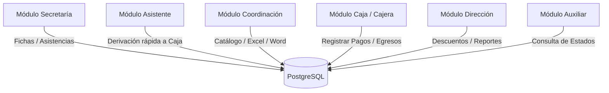
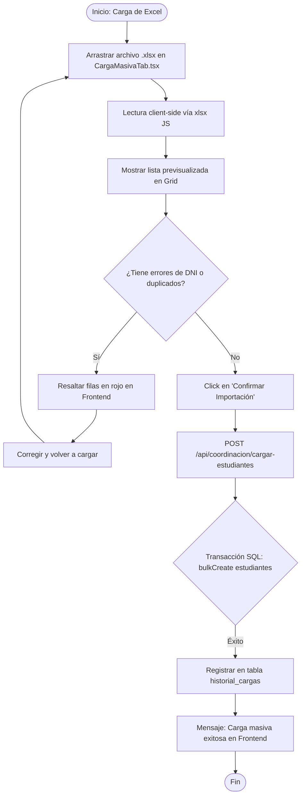
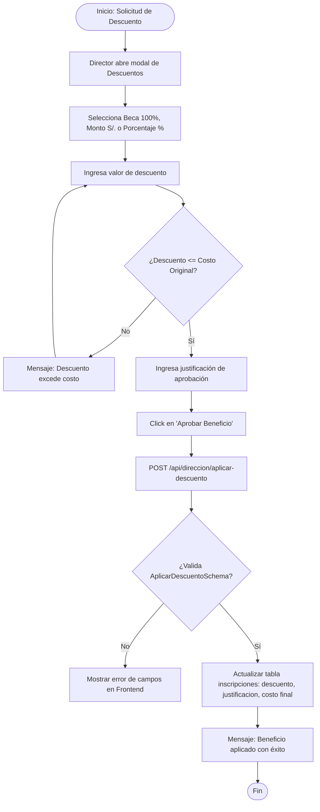

# Documentación de Requisitos Funcionales Detallados (Nivel Senior) - Módulo Extracurricular

Esta especificación detalla de forma exhaustiva los requerimientos de la plataforma **Módulo Extracurricular** (Colegio San Rafael) a nivel técnico y funcional de arquitectura. Define para cada módulo y sub-módulo sus responsabilidades detalladas de Frontend (interfaz de usuario, hooks, componentes e interacciones) y Backend (rutas de API, esquemas Zod DTO, lógica relacional y transacciones en base de datos PostgreSQL 17).

---

## 1. Módulos y Roles del Sistema

El sistema implementa **6 perfiles de acceso (roles)** que interactúan sobre la base de datos relacional:



### 1.1. Diagrama de Flujo General: Matrícula y Cobro en Caja

```mermaid
sequenceDiagram
    autonumber
    actor Apoderado as Apoderado / Alumno
    actor Sec as Secretaria (Frontend)
    participant API as Backend (Express)
    database DB as Base de Datos (Postgres)
    actor Cajera as Cajera (Caja)

    Apoderado->>Sec: Presenta DNI y solicita Taller
    Sec->>API: GET /api/secretaria/estudiante/:dni
    API->>DB: Consultar padrón regular
    DB-->>API: Datos del Alumno (Grado/Sección)
    API-->>Sec: Datos del Alumno
    Sec->>Sec: Valida campos y selecciona Uniformes
    Sec->>API: POST /api/secretaria/registrar-regular (CrearInscripcionSchema)
    API->>DB: Crear Inscripción con estado "Pendiente"
    DB-->>API: Confirmación
    API-->>Sec: Inscripción derivando a Caja
    Sec-->>Apoderado: Indica pasar a Caja
    Apoderado->>Cajera: Plataforma de cobro
    Cajera->>API: GET /api/caja/pendientes
    API->>DB: Consultar inscripciones con estado "Pendiente"
    DB-->>API: Lista de pendientes
    API-->>Cajera: Muestra ficha del estudiante y monto
    Cajera->>API: POST /api/caja/registrar-pago (RegistrarPagoSchema)
    API->>DB: Transacción: Actualiza a "Pagado", reduce cupo, incrementa correlativo
    DB-->>API: Transacción completada con éxito
    API-->>Cajera: Recibo generado (REC-XXXX)
    Cajera-->>Apoderado: Entrega comprobante de pago
```

---

## 2. Detalle Funcional por Módulo y Sub-Módulo

### 2.1. Módulo de Secretaría
El Módulo de Secretaría gestiona el flujo de contacto inicial, pre-inscripciones y registro de servicios adicionales.

#### Sub-módulo 2.1.1: Ficha de Inscripción Regular
*   **Descripción**: Matricular a un estudiante regular del colegio (que ya existe en el padrón de alumnos) en un taller o programa complementario.
*   **Detalle del Frontend**:
    *   *Componente Principal*: `SecretariaNormalRegistroForm.tsx`.
    *   *Flujo de Interacción*:
        1. El usuario ingresa el DNI en el buscador rápido. El componente ejecuta una validación de expresión regular para verificar que contenga exactamente 8 caracteres numéricos.
        2. Al cumplirse la longitud, dispara un efecto de búsqueda llamando al endpoint de consulta del alumno.
        3. Si la respuesta es exitosa (HTTP 200), el formulario realiza un autocompletado en cascada de los campos de solo lectura (`nombres`, `apellidos`, `grado`, `seccion`, `nivel`).
        4. Si el estudiante no existe, muestra una alerta tipo `sonner` indicando que no pertenece al padrón regular y sugiere usar el formulario vacacional/externo.
        5. Permite ingresar o actualizar los campos del apoderado: `apoderado` (nombre), `telefono_apoderado` (sólo dígitos, mín. 9 caracteres) y `correo_apoderado` (formato de correo válido).
*   **Detalle del Backend**:
    *   *Ruta / Endpoint*: `POST /api/padres-inscripcion/inscripciones`.
    *   *Esquema de Validación Zod*: `CrearInscripcionSchema` que valida:
        *   `estudiante_id`: `z.string({ message: "El DNI del estudiante es requerido" })`
        *   `programa_id`: `z.string({ message: "El ID del programa es requerido" })`
        *   `apoderado`: `z.string().optional()`
        *   `telefono_apoderado`: `z.string().optional()`
        *   `correo_apoderado`: `z.string().optional()`
    *   *Lógica del Servidor*:
        1. Consulta la base de datos para confirmar que el DNI existe en la tabla `estudiantes`. Si no se encuentra, retorna un HTTP 404.
        2. Valida si ya existe una inscripción activa del estudiante en el programa seleccionado. Si existe, lanza un HTTP 400 con el mensaje "El estudiante ya está inscrito en este programa".
        3. Inserta una fila en la tabla `inscripciones` en estado `Pendiente`.
        4. Actualiza los campos de contacto del apoderado en la fila del estudiante en la tabla `estudiantes` usando una cláusula UPDATE de Sequelize.

#### Sub-módulo 2.1.2: Ficha de Alumno Externo / Invitado
*   **Descripción**: Registrar y matricular alumnos que no son parte del alumnado regular de la institución.
*   **Detalle del Frontend**:
    *   *Componente Principal*: `SecretariaSummerRegistroForm.tsx`.
    *   *Flujo de Interacción*:
        1. A diferencia del formulario regular, todos los campos del alumno están habilitados para escritura manual (`nombres`, `apellidos`, `DNI`, `sexo`, `fecha de nacimiento`, `grado` y `sección` de procedencia).
        2. Cuenta con un selector obligatorio para definir al alumno como `Externo` o `Invitado`.
        3. Realiza validaciones del tipo de dato en cliente antes de habilitar el botón de envío.
*   **Detalle del Backend**:
    *   *Ruta / Endpoint*: `POST /api/secretaria/registrar-externo` (o similar).
    *   *Lógica del Servidor*:
        1. Valida la información general recibida.
        2. Inserta al estudiante directamente en la tabla `estudiantes` marcando el campo `tipoAlumno` como `'externo'` o `'invitado'`.
        3. Crea la correspondiente matrícula en la tabla `inscripciones` con el estado inicial `Pendiente` y calcula el costo correspondiente.

#### Sub-módulo 2.1.3: Selector de Uniformes y Kits
*   **Descripción**: Registrar ventas de kits de uniformes deportivos u otras indumentarias requeridas para el taller.
*   **Detalle del Frontend**:
    *   *Componente Principal*: `SecretariaUniformeSelector.tsx`.
    *   *Flujo de Interacción*:
        1. Al marcar el checkbox "Requiere Uniforme", se despliega la interfaz de tallaje.
        2. Permite elegir de manera independiente las tallas de Polo y Short del taller en base a un listado fijo: `2`, `4`, `6`, `8`, `10`, `12`, `14`, `16`, `S`, `M`, `L`.
        3. Cuenta con inputs para definir la cantidad de kits.
        4. Calcula en caliente en cliente el incremento del costo del uniforme (costo unitario * cantidad) y actualiza visualmente el total de cobro.
*   **Detalle del Backend**:
    *   *Esquema de Validación Zod*: Lee las propiedades `talla_polo` y `talla_short` en `CrearInscripcionSchema`.
    *   *Lógica del Servidor*:
        1. Si se especifican las tallas, el servidor calcula el importe correspondiente de acuerdo al catálogo de precios configurados.
        2. Crea un registro en la tabla `inscripcion_servicios` detallando el tipo de uniforme, las tallas elegidas y el monto respectivo.
        3. Vincula este monto como un recargo por pagar en la transacción final de caja.

#### Sub-módulo 2.1.4: Marcación de Asistencia
*   **Descripción**: Controlar y registrar las marcaciones de asistencia diarias de los estudiantes de cada taller.
*   **Detalle del Frontend**:
    *   *Componente Principal*: `SecretariaAsistenciaModal.tsx`.
    *   *Flujo de Interacción*:
        1. Muestra un selector de clase/sesión del taller y la fecha del día actual.
        2. Dibuja un listado con los alumnos inscritos activos del programa.
        3. Renderiza cuatro botones tipo radio por estudiante para los estados: `Asistió`, `Tardanza`, `Falta Justificada` y `Falta Injustificada`.
        4. Al hacer click en "Guardar Marcaciones", envía el lote completo de asistencias al servidor.
*   **Detalle del Backend**:
    *   *Ruta / Endpoint*: `POST /api/secretaria/asistencia`.
    *   *Lógica del Servidor*:
        1. Recibe el arreglo JSON de marcaciones.
        2. Realiza un `bulkCreate` sobre la tabla `asistencias`. Cada fila registra el `inscripcion_id`, la fecha de la sesión, el estado asignado (`asistio`, `falta`, `tardanza`) y la marca de tiempo de auditoría del servidor.

---

### 2.2. Módulo de Asistente

#### Sub-módulo 2.2.1: Derivación Rápida a Caja
*   **Descripción**: Registrar de manera simplificada e inmediata un interés de matrícula y enviarlo directamente a la cola de cobros de la Cajera.
*   **Detalle del Frontend**:
    *   *Componente Principal*: Panel rápido de asistente.
    *   *Flujo de Interacción*:
        1. Entrada rápida del DNI del alumno para validar en cliente y autocompletar su grado/nivel.
        2. Selector simple para elegir el programa.
        3. Al dar click en "Matricular y Derivar", envía la petición y muestra un mensaje indicando que el cobro ha sido derivado a la cola de Caja con éxito.
*   **Detalle del Backend**:
    *   *Ruta / Endpoint*: `POST /api/padres-inscripcion/derivar-caja`.
    *   *Esquema de Validación Zod*: `DerivarCajaSchema` valida `dni_estudiante` (DNI), `costo` y `costoOriginal`.
    *   *Lógica del Servidor*:
        1. Inserta el registro de matrícula en la tabla `inscripciones` en estado `Pendiente`.
        2. No genera boleta en caja en este paso, sino que la prepara como una cuenta por cobrar que aparecerá al consultar las matrículas pendientes de pago.

---

### 2.3. Módulo de Coordinación Académica

#### Sub-módulo 2.3.1: Configuración de Talleres (Formulario con Pestañas)
*   **Pestaña 1: Datos Generales**:
    *   *Frontend*: Contiene inputs para nombre del taller, categoría, cupos máximos, costo total y un multiselector para elegir los grados escolares elegibles (ej. Inicial 3 años, Primer grado, etc.).
    *   *Backend (Zod DTO)*: `ProgramaSchema` valida `nombre_programa`, `categoria`, `monto` (costo) y `cupos`. Crea la fila en la tabla `programas` de PostgreSQL.
*   **Pestaña 2: Fechas y Horarios**:
    *   *Frontend*: Selector de rango de fechas de inicio y fin del taller. Utiliza el sub-componente `GrupoHorariosList.tsx` para agregar bloques de horarios asignando día de la semana, hora de inicio y fin, grupo (ej. Grupo A, Grupo B) y docente asignado.
    *   *Backend*: Inserta la configuración de horarios estructurada en la tabla `programas_horarios`.
*   **Pestaña 3: Requisitos y Materiales**:
    *   *Frontend*: Textareas dentro de `SeccionRequisitosMateriales.tsx` para definir requisitos académicos (ej. "Tener aprobado nivel básico") y materiales a comprar o traer.
    *   *Backend*: Guarda el texto saneado en el campo `requisitos` en la tabla `programas_configuraciones`.
*   **Pestaña 4: Cambridge (Exámenes Internacionales)**:
    *   *Frontend*: Habilita controles para exámenes internacionales. Selectores de precios individuales (Starters, Movers, Flyers, KET, PET) y calendario interactivo para programar las cuotas mensuales (hasta 3 cuotas con fechas de vencimiento).
    *   *Backend*: Parsea los montos y guarda la configuración de cuotas de exámenes en la tabla `programas_servicios`.
*   **Pestaña 5: Documentos Oficiales**:
    *   *Frontend*: Interfaz `SeccionDocumentoOficial.tsx` con drag & drop de plantillas Microsoft Word `.docx` con marcadores especiales.
    *   *Backend*: Sube la plantilla al servidor y la registra en `programas_documentos`. Al matricularse un estudiante, el servidor lee la plantilla y utiliza `docxtemplater` para parsear el archivo y rellenar las etiquetas (`{ESTUDIANTE}`, `{DNI}`, `{FECHA_EXAMEN}`) con los datos reales del estudiante, sirviendo el documento personalizado al instante.

#### Sub-módulo 2.3.2: Carga Masiva de Alumnos (Excel)
*   **Descripción**: Carga e importación en bloque de padrones de estudiantes mediante archivos Excel.
*   **Detalle del Frontend**:
    *   *Componente Principal*: `CargaMasivaTab.tsx`.
    *   *Flujo de Interacción*:
        1. Zona de drop para archivos con extensión `.xlsx` o `.xls`.
        2. Lee y parsea localmente en cliente el archivo mediante la librería `xlsx`.
        3. Dibuja los datos en una cuadrícula interactiva (DNI, nombres, grado, sección).
        4. Ejecuta validaciones de duplicados de DNI y formatos en caliente y los resalta visualmente en color rojo en la tabla si contienen errores.
*   **Detalle del Backend**:
    *   *Ruta / Endpoint*: `POST /api/coordinacion/cargar-estudiantes`.
    *   *Lógica del Servidor*:
        1. Recibe el JSON de alumnos validados.
        2. Abre una transacción SQL en PostgreSQL.
        3. Ejecuta un `bulkCreate` sobre la tabla `estudiantes`. Configura la cláusula `updateOnDuplicate` para actualizar campos como sección o grado si el DNI ya existía.
        4. Inserta un log de control con el número de alumnos cargados en la tabla `historial_cargas` y completa la transacción.



---

### 2.4. Módulo de Cajera (Caja)
Este módulo controla los flujos contables, cuadre de caja diario y transacciones.

#### Sub-módulo 2.4.1: Cobro de Matrículas (Caja Cobros)
*   **Descripción**: Liquidar cobros pendientes de matrículas y emitir el recibo correlativo de pago.
*   **Detalle del Frontend**:
    *   *Componente Principal*: `CajaCobros.tsx`.
    *   *Flujo de Interacción*:
        1. Muestra la cola de estudiantes con matrículas en estado `Pendiente`.
        2. Permite buscar por DNI/nombres. Al hacer click en el alumno, carga el desglose financiero del cobro (Costo original, descuento y costo final neto).
        3. Selector de tipo de pago obligatorio: `Efectivo`, `Yape`, `Plim` o `Transferencia`.
        4. Muestra un cuadro de confirmación con el código del recibo que se va a generar (REC-XXXX).
*   **Detalle del Backend**:
    *   *Ruta / Endpoint*: `POST /api/caja/registrar-pago`.
    *   *Esquema de Validación Zod*: `RegistrarPagoSchema` valida `inscripcion_id`, `monto_pago`, `metodo_pago`, `numero_operacion`, `telefono_operacion` y `fecha`.
    *   *Lógica del Servidor*:
        1. Inicia una transacción de base de datos.
        2. Bloquea la fila del taller asociado en `programas` para evitar sobreventa (race conditions). Verifica si existen cupos libres. Si está lleno, aborta y retorna HTTP 400.
        3. Cambia el estado de la inscripción a `'Pagado'` en la tabla `inscripciones`.
        4. Incrementa el contador de cupos ocupados en la tabla `programas`.
        5. Consulta el correlativo actual en `configuracion` y genera la fila en la tabla `pagos` (tipo transacción `'Ingreso'`, asignando el número de recibo correlativo).
        6. Actualiza el contador del correlativo de caja sumando 1 en `configuracion`.
        7. Cierra la transacción SQL de forma atómica y exitosa.

#### Sub-módulo 2.4.2: Anulación de Recibo
*   **Descripción**: Anular una boleta física o virtual del sistema por error humano o cancelación del taller.
*   **Detalle del Frontend**:
    *   *Componente Principal*: `CajaCancelarCorrelativo.tsx`.
    *   *Flujo de Interacción*:
        1. Formulario donde se ingresa el número de recibo (REC-XXXX) a anular.
        2. Requiere obligatoriamente un texto en el campo de justificación/motivo de la anulación (mínimo 10 caracteres).
        3. Checkbox para elegir si se debe retroceder o avanzar el correlativo físico.
*   **Detalle del Backend**:
    *   **Endpoint**: `POST /api/caja/anular-recibo`.
    *   **Esquema de Validación Zod**: `CancelarCorrelativoSchema` (campos `tipo`, `motivo`, `nroRecibo`, `dniEstudiante`).
    *   **Lógica del Servidor**:
        1. Busca el recibo en la tabla `pagos`. Si no existe, retorna HTTP 404.
        2. Actualiza los valores financieros del recibo a `0.00` y cambia el campo `estado` a `'anulado'`.
        3. Registra el motivo detallado de la anulación en el campo `observaciones`.
        4. Crea una fila en la tabla `audit_logs` registrando la fecha de la anulación, el ID del recibo y el nombre de la cajera que ejecutó el proceso.

#### Sub-módulo 2.4.3: Registro de Egresos y Caja Chica
*   **Descripción**: Registrar salidas de dinero del efectivo en caja por gastos de mantenimiento o urgencias.
*   **Detalle del Frontend**:
    *   *Flujo de Interacción*: Formulario para registrar el monto, concepto o motivo del gasto, y el DNI y nombre de la persona que recibe el efectivo.
*   **Detalle del Backend**:
    *   *Ruta / Endpoint*: `POST /api/caja/registrar-egreso`.
    *   *Esquema de Validación Zod*: `RegistrarEgresoSchema` (campos `monto`, `concepto`, `beneficiario`, `dni`).
    *   *Lógica del Servidor*:
        1. Valida los campos ingresados.
        2. Inserta una fila en la tabla `pagos` con el tipo de transacción `'Egreso'`, guardando el monto con signo negativo en los cálculos de balance.

#### Sub-módulo 2.4.4: Exportación de Cierre y Reportes a Excel
*   **Descripción**: Generación de reportes financieros estilizados del colegio en formato Excel.
*   **Detalle del Frontend**:
    *   Filtros en el header (`CajaReportes.css`) para seleccionar mes, año, medio de pago y estado de cobros.
    *   Botón para disparar la petición de reporte Excel.
*   **Detalle del Backend**:
    *   *Ruta / Endpoint*: `GET /api/caja/reportes/excel`.
    *   *Lógica del Servidor*:
        1. Realiza una consulta filtrada en base de datos PostgreSQL.
        2. Instancia la librería `exceljs` para crear un libro en memoria.
        3. Crea las celdas y filas aplicando el diseño institucional: colores corporativos del colegio (Teal `#0f766e`), bordes limpios, cabeceras en negrita y alineaciones adecuadas.
        4. Agrega fórmulas de suma automáticas para calcular el total neto cobrado al final de la hoja.
        5. Escribe el libro en el buffer y lo retorna con las cabeceras HTTP correctas (`Content-Type: application/vnd.openxmlformats-officedocument.spreadsheetml.sheet`) para provocar la descarga en el navegador.

---

### 2.5. Módulo de Dirección
El Módulo de Dirección permite al director supervisar el dinero recaudado y autorizar beneficios económicos especiales.

#### Sub-módulo 2.5.1: Dashboard y Métricas de Recaudación
*   **Descripción**: Panel analítico con los consolidados contables en vivo del colegio.
*   **Detalle del Frontend**:
    *   Tarjetas de métricas estadísticas (Recaudado total, deudores, vacantes libres).
    *   Gráficos circulares de distribución de ingresos y gráficos de barras de matrículas por categoría usando la librería Mantine Charts.
*   **Detalle del Backend**:
    *   *Ruta / Endpoint*: `GET /api/direccion/dashboard`.
    *   *Lógica del Servidor*:
        1. Ejecuta queries agrupadas (`SUM` y `COUNT`) con Sequelize.
        2. Agrupa los ingresos de la tabla `pagos` por medio de pago (Efectivo, Yape, Plim, Transferencia).
        3. Calcula la lista de alumnos con matrículas en estado `Pendiente` (deudores) y retorna el JSON consolidado.

#### Sub-módulo 2.5.2: Aprobación de Descuentos y Becas Especiales
*   **Descripción**: Otorgar descuentos fijos, porcentuales o becas completas del 100% sobre talleres.
*   **Detalle del Frontend**:
    *   *Componente Principal*: `DireccionDescuentos.tsx` (diseño de formulario vertical ordenado).
    *   *Flujo de Interacción*:
        1. El director abre el modal sobre la pre-inscripción pendiente de un estudiante.
        2. Muestra los datos de la matrícula (Nombre del taller y Costo original S/.).
        3. Selector del tipo de beneficio: `Beca Completa (100% descuento)`, `Descuento de monto (S/.)` o `Descuento porcentual (%)`.
        4. Inputs dinámicos que validan en caliente: si es porcentual, el valor no puede superar 100; si es por monto, el descuento no puede superar el costo original del taller. El botón de envío permanece inhabilitado si el descuento es inválido.
        5. Textarea obligatorio para ingresar la Justificación o Motivo de la Aprobación (mínimo 5 caracteres).
*   **Detalle del Backend**:
    *   *Ruta / Endpoint*: `POST /api/direccion/aplicar-descuento`.
    *   *Esquema de Validación Zod*: `AplicarDescuentoSchema` que valida:
        *   `inscripcionId`: `z.string({ message: "El ID de inscripción es requerido" })`
        *   `tipo`: `z.string().optional()` (beca, monto, porcentaje)
        *   `valor`: `z.union([z.number(), z.string()]).optional()`
        *   `justificacion`: `z.string({ message: "La justificación es requerida" }).min(1)`
    *   *Lógica del Servidor*:
        1. Verifica la existencia de la matrícula en la tabla `inscripciones`.
        2. Compara el descuento solicitado contra el costo original del programa en base de datos para prevenir manipulaciones maliciosas de la API.
        3. Actualiza el registro de la matrícula en `inscripciones` guardando el tipo de descuento, el valor aplicado, la justificación, y reduce el costo final neto a pagar.
        4. Registra un log en la tabla `audit_logs` detallando la aprobación del beneficio.



#### Sub-módulo 2.5.3: Ajustes de Contadores
*   **Descripción**: Habilitar a la dirección a reiniciar o ajustar la numeración de los recibos de caja chica o ingresos.
*   **Detalle del Frontend**: Inputs interactivos que cargan el correlativo actual y permiten establecer nuevos límites de numeración.
*   **Detalle del Backend**: Endpoint `POST /api/direccion/configurar-correlativos` que valida el body con `UpdateCorrelativosSchema` y actualiza la fila de control global en la tabla de configuración.

---

### 2.6. Módulo de Auxiliar

#### Sub-módulo 2.6.1: Consulta Rápida de Alumnos
*   **Descripción**: Vista de patio simplificada e intuitiva para consultar de un vistazo el taller, asistencia y pago de un estudiante.
*   **Detalle del Frontend**:
    *   Interfaz con buscador de DNI/Nombre adaptada para pantallas móviles.
    *   Tarjeta limpia que dibuja semáforos de estado (Verde: Al día/Asistió, Rojo: Deudor/Falta).
*   **Detalle del Backend**:
    *   *Ruta / Endpoint*: `GET /api/auxiliar/estudiante/:dni`.
    *   *Lógica del Servidor*: Realiza un join rápido entre `estudiantes`, `inscripciones` y la tabla `asistencias` para consolidar el estado del estudiante y lo retorna en un JSON optimizado.
