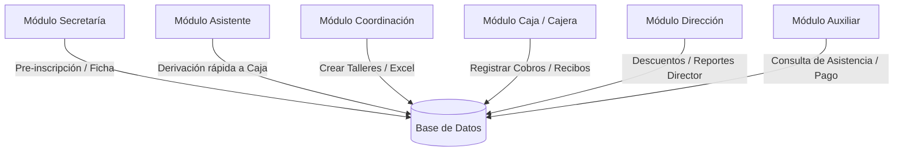

# Documentación de Requisitos Funcionales - Módulo Extracurricular

Esta sección documenta los requisitos funcionales del sistema **Módulo Extracurricular** basándose en la arquitectura de roles y flujos implementados en el código de producción.

---

## 1. Módulos y Roles del Sistema

El sistema implementa **6 perfiles de acceso (roles)** diferenciados que interactúan sobre la base de datos de estudiantes, matrículas y caja:

---

## 2. Especificación Detallada de Requisitos Funcionales

---

### 2.1. Módulo de Secretaría
El Módulo de Secretaría gestiona el flujo de contacto inicial, pre-inscripciones y registro de servicios adicionales.

#### RF-1.1: Registro de Ficha Regular
*   **Descripción**: Matricular a un estudiante regular del colegio (que ya existe en el padrón de alumnos) en un taller/programa.
*   **Reglas de Negocio**:
    *   El alumno debe tener un DNI válido y estar registrado en el padrón (`estudiantes`).
    *   Se consultan los datos del alumno (Apellidos, Nombres, Grado y Sección) de manera automática al ingresar el DNI.
    *   Permite ingresar o actualizar los datos del apoderado (Nombre completo, DNI, teléfono y correo electrónico de contacto).
    *   Asocia al estudiante a un programa/taller filtrado según su grado escolar aplicable.

#### RF-1.2: Registro de Ficha de Verano (Estudiantes Externos / Invitados)
*   **Descripción**: Matricular a estudiantes ajenos a la institución que asisten únicamente durante la temporada vacacional de verano.
*   **Reglas de Negocio**:
    *   Registra información completa desde cero (Nombres, Apellidos, DNI, Grado, Nivel, Sección de origen y Sexo).
    *   Permite marcar al alumno con la categoría `Invitado / Externo` para diferenciarlo en reportes contables.
    *   Permite asociar datos del apoderado y seleccionar un taller vacacional disponible.

#### RF-1.3: Gestión de Servicios Adicionales y Uniformes
*   **Descripción**: Registrar compras de materiales o servicios relacionados con el taller durante el registro.
*   **Reglas de Negocio**:
    *   **Uniformes**: Permite al usuario seleccionar el kit de uniformes del taller (Polo, Short y/o Medias), seleccionando tallas (`2`, `4`, `6`, `8`, `10`, `12`, `14`, `16`, `S`, `M`, `L`) y cantidad.
    *   El sistema calcula el costo adicional del uniforme y lo suma al monto total a ser pagado.
    *   **Servicio Cambridge / Almuerzos**: Permite añadir costos especiales para cursos de idiomas (exámenes internacionales) o paquetes de almuerzo/comedor escolar.

#### RF-1.4: Registro de Asistencia
*   **Descripción**: Permite marcar asistencia del alumno en las clases del taller correspondiente.
*   **Reglas de Negocio**:
    *   Búsqueda del alumno por DNI o nombres.
    *   Muestra un listado de sesiones del taller y permite marcar estados: `Asistió`, `Falta Justificada`, `Falta Injustificada` y `Tardanza`.

---

### 2.2. Módulo de Asistente
El Módulo de Asistente es una versión simplificada del registro para agilizar el flujo diario en oficinas de atención.

#### RF-2.1: Derivación Rápida a Caja
*   **Descripción**: Registrar de manera veloz la intención de inscripción de un alumno y enviarlo directamente a la cola de cobros de Caja.
*   **Reglas de Negocio**:
    *   Ingreso rápido del DNI del alumno para extraer datos básicos.
    *   Selección del taller/programa derivado.
    *   Al guardar, el registro se guarda en la tabla `inscripciones` con el estado `Pendiente`, apareciendo al instante en la cola de la cajera.

---

### 2.3. Módulo de Coordinación Académica
Gestiona el catálogo de talleres, plantillas de documentos oficiales y la carga masiva de alumnos.

#### RF-3.1: Configuración de Talleres y Programas
*   **Descripción**: Permite al coordinador crear, editar y archivar talleres deportivos, académicos o artísticos.
*   **Reglas de Negocio**:
    *   **Datos Generales**: Nombre del programa, Categoría (Deportes, Académico, Idiomas), Fechas de Inicio y Fin, Periodo escolar (ej. 2026-I) e Imagen/Anuncio promocional.
    *   **Costo y Cupos**: Costo base (S/.) y límite máximo de cupos. El contador de cupos ocupados se actualiza automáticamente con cada matrícula cobrada.
    *   **Grados Aplicables**: Checkbox selector de los grados escolares que pueden matricularse (evita que alumnos de Inicial se inscriban en talleres exclusivos de Secundaria).
    *   **Horarios y Requisitos**: Configuración de los días, horas de clase, profesores asignados, y requisitos del taller.

#### RF-3.2: Carga Masiva de Alumnos desde Excel
*   **Descripción**: Cargar listados completos de estudiantes desde plantillas de Excel para poblar la base de datos sin ingreso manual.
*   **Reglas de Negocio**:
    *   Permite arrastrar o cargar un archivo `.xlsx`.
    *   El frontend parsea el archivo y muestra una previsualización de los datos (DNI, nombres, apellidos, grado, nivel, sección).
    *   Valida registros duplicados o DNI inválidos en pantalla antes de confirmar la importación.

#### RF-3.3: Gestión de Plantillas Word (Documentos Oficiales)
*   **Descripción**: Asociar plantillas de Microsoft Word (`.docx`) a los talleres (como fichas de exámenes internacionales Cambridge).
*   **Reglas de Negocio**:
    *   Permite cargar archivos `.docx` con variables parametrizadas (ej. `{ESTUDIANTE}`, `{DNI}`, `{FECHA_EXAMEN}`).
    *   El backend genera y completa estas plantillas de forma dinámica con la información del alumno al concretarse la matrícula.

---

### 2.4. Módulo de Cajera (Caja)
Este módulo controla los flujos monetarios del sistema, los comprobantes de pago y el balance diario.

#### RF-4.1: Registrar Cobros de Talleres
*   **Descripción**: Procesar el pago de un estudiante matriculado o derivado.
*   **Reglas de Negocio**:
    *   Muestra un listado de estudiantes con pagos pendientes.
    *   Permite buscar por DNI o Nombre completo.
    *   Muestra los datos del alumno y el desglose del monto (costo original, descuento/beca autorizada, costo final a pagar).
    *   **Medio de Pago**: Permite seleccionar `Efectivo`, `Yape`, `Plim` o `Transferencia`.
    *   **Comprobante**: Muestra una vista previa del correlativo automático del recibo (`REC-XXXX`). El número avanza automáticamente al confirmar la transacción.
    *   Al guardar, se mantiene el estado de la matrícula a `Pagado` y se emite la confirmación visual de éxito.

#### RF-4.2: Anulación de Correlativo / Recibos
*   **Descripción**: Anular un número de comprobante físico por daño, error de impresión o anulación directa.
*   **Reglas de Negocio**:
    *   Permite registrar un recibo específico como `ANULADO` en el sistema.
    *   Registra el monto de la transacción en `S/ 0.00` y requiere obligatoriamente una **Justificación o Motivo de la Anulación**.
    *   Permite marcar una casilla para avanzar o no el contador del correlativo de caja.

#### RF-4.3: Registro de Egresos y Gastos
*   **Descripción**: Registrar salidas de dinero en efectivo de la caja por gastos operativos menores.
*   **Reglas de Negocio**:
    *   Ingreso del Monto egresado (S/.), Concepto/Descripción del gasto, y el nombre de la persona que recibe el dinero.
    *   Genera un recibo de egreso con numeración correlativa independiente para el cuadre de caja.

#### RF-4.4: Control y Exportación de Reportes
*   **Descripción**: Visualizar transacciones realizadas y exportar a hojas de cálculo.
*   **Reglas de Negocio**:
    *   Filtros dinámicos por **Mes**, **Año**, **Medio de pago**, **Grado**, **Sección** y **Estado de pago**.
    *   Exporta el reporte filtrado directamente a un archivo Excel (`.xlsx`) utilizando `ExcelJS`, conservando colores, sumatorias y formato formal del colegio.

---

### 2.5. Módulo de Dirección
El Módulo de Dirección permite al director supervisar el dinero recaudado y autorizar beneficios económicos especiales.

#### RF-5.1: Dashboard y Métricas en Vivo
*   **Descripción**: Tarjetas estadísticas y gráficos con el estado financiero en vivo.
*   **Reglas de Negocio**:
    *   Muestra el acumulado de ingresos por Efectivo, Yape/Plim y Transferencias.
    *   Muestra listados de talleres con más cupos ocupados y listas de alumnos deudores.

#### RF-5.2: Autorización de Descuentos y Becas
*   **Descripción**: Aplicar rebajas o exoneraciones de pago sobre las matrículas pendientes de los alumnos.
*   **Reglas de Negocio**:
    *   Permite seleccionar una pre-inscripción pendiente y abrir el modal de beneficio.
    *   **Tipos de Beneficio**:
        *   `Beca Completa (100% descuento)`: El costo final a pagar se reduce a `S/ 0.00`.
        *   `Descuento de monto (S/.)`: Rebaja una cantidad fija en soles. El monto del descuento no puede superar el costo original.
        *   `Descuento porcentual (%)`: Aplica un porcentaje de rebaja. El porcentaje no puede superar el 100%.
    *   **Justificación**: Es un campo de texto obligatorio. El beneficio no se puede procesar sin una justificación o motivo documentado (ej. "Convenio institucional", "Beca socioeconómica").
    *   Al autorizar, se guarda la reducción de costo asociada al alumno y se le notifica a la Cajera automáticamente en su cola de cobros.

#### RF-5.3: Ajustes y Contadores de Caja
*   **Descripción**: Configurar y reiniciar los números correlativos iniciales de los recibos de cobro y de egresos.

---

### 2.6. Módulo de Auxiliar
*   **Descripción**: Consulta rápida del estado de los alumnos por parte del personal auxiliar de patio o talleres.
*   **Reglas de Negocio**:
    *   Búsqueda simple de estudiantes por DNI o Nombres.
    *   Permite visualizar el historial de talleres inscritos del alumno, su estado de asistencia del día, y si su pago se encuentra al día o pendiente de cobro.
